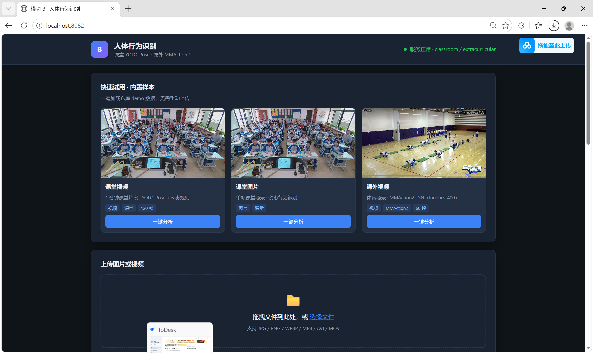
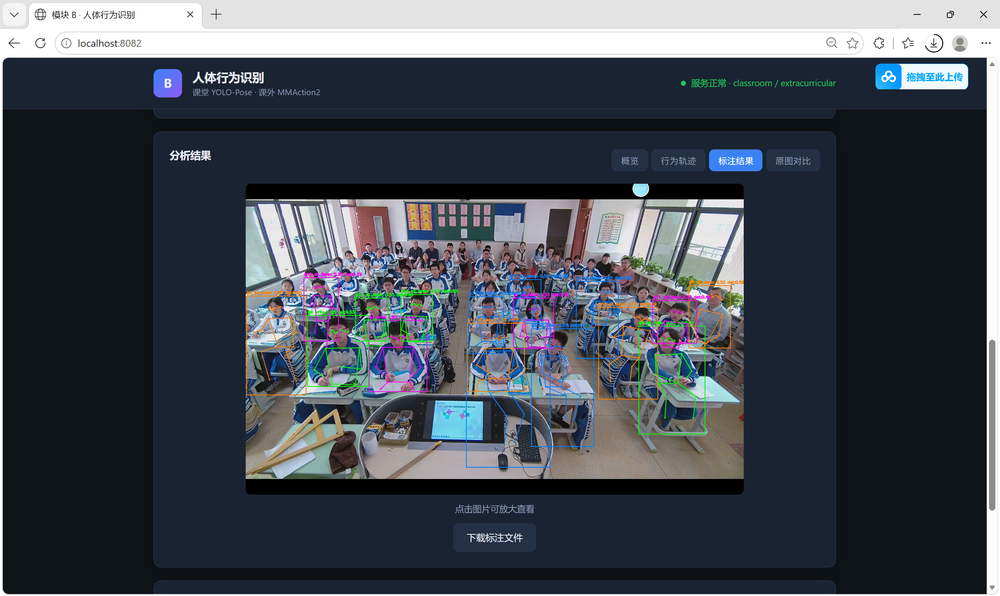
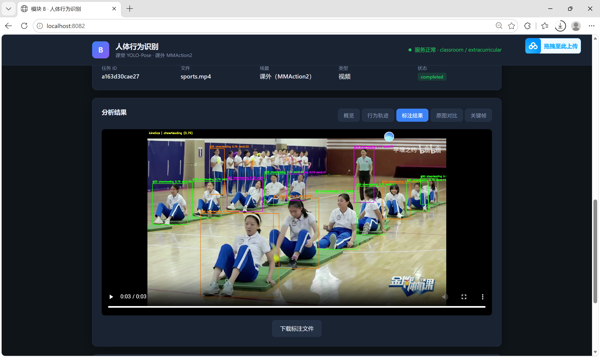

# 模块 B 人体行为识别 — 项目实操手册（推理专用版）

> **目录**：`module_b_behavior/`  
> **Python**：3.10+（CPU 可跑）  

---

## 目录

1. [第 1 步：使用说明 — 需求、目录结构、数据与模型](#1-使用说明)
2. [第 2 步：搭建环境 — 安装依赖、加载配置、确认 demo 与模型](#第-2-步搭建环境确认-demo-与模型)
3. [第 3 步：室内图片推理 — 规则引擎 + 图片流水线](#第-3-步室内图片推理)
4. [第 4 步：室内视频推理 — 跟踪 + 片段聚合 + 视频流水线](#第-4-步室内视频推理)
5. [第 5 步：室外行为识别 — YOLO + MMAction2 TSN](#第-5-步室外行为识别mmaction2)
6. [第 6 步：RESTful API — 行为分析接口服务化](#第-6-步restful-api)
7. [第 7 步：Web 前端 — 可视化交互](#第-7-步web-前端)
8. [附录 B：命令速查](#附录-b命令速查)
9. [附录 C：测试清单](#附录-c测试清单)

---

## 1. 使用说明

### 1.1 需求简述

实现一个人体行为识别系统，支持两种场景：

| 场景 | 输入 | 输出 |
| --- | --- | --- |
| **室内** | 图片 / 视频 | 6 类行为：听讲、举手、写字、低头、站立、未知 |
| **室外** | 仅视频 | Kinetics-400 的 400 类行为标签 |

核心能力：

- **检测**：YOLO 定位画面中所有人
- **跟踪**：ByteTrack 给每人分配唯一 ID
- **识别**：室内靠姿态规则推断，室外靠 MMAction2 TSN 时序分类
- **输出**：标注视频 / 标注图片 / 行为统计 / JSON 结构化结果
- **交互**：命令行（`run_infer.py`）+ Web UI（`run_api.py`）两种入口

> **数据与权重声明**：本版所提供 demo 数据及推理权重均来源于互联网公开数据集，其中可能涉及人物影像，使用者应切实保护相关方隐私。所有资料**仅限本赛项训练与比赛使用**，不得外传或另作他用。


### 1.3 根目录入口

工程**两个主程序**：

| 程序　　　　　　　 | 类别　　　　| 用途　　　　　　　　　　　　　　　　　 |
| --------------------| -------------| ----------------------------------------|
| **`run_api.py`**　 | 推理 + 前端 | 启动 Web UI + REST API（**推荐演示**） |
| **`run_infer.py`** | 推理　　　　| 命令行推理（室内/室外，图片/视频）　　 |

环境检查、benchmark 冒烟等**辅助脚本**在 `scripts/`，不算主入口。

```bash
# Web 演示（推荐）
python run_api.py --port 8082

# 命令行推理
python run_infer.py --media <路径> --scene classroom --output output/xxx
python run_infer.py --media data/demo/extracurricular/sports.mp4 --scene extracurricular --max-frames 60 --output output/sports
```

### 1.4 最终目录

```
module_b_behavior/
├── run_api.py            # Web + API
├── run_infer.py          # CLI 推理
├── configs/              # classroom.yaml、extracurricular.yaml
├── src/                  # 核心源码（含 web/ 前端、api、classroom、extracurricular …）
├── data/demo/            # 演示图片与视频（已提供）
├── models/               # 预训练推理权重（已提供）
├── scripts/              # 辅助：环境检查、benchmark、MMAction 验证
├── tests/
└── output/               # 运行后生成
```

### 1.5 数据与模型说明

**本版已提供 demo 数据与推理权重，无需下载训练集。**

| 类别 | 路径 | 说明 |
| --- | --- | --- |
| 室内 demo | `data/demo/` | 室内推理演示视频与图片 |
| 室外 demo | `data/demo/extracurricular/` | MMAction2 演示（含 `sports.mp4`） |
| YOLO 权重 | `models/yolo/` | `yolov8n.pt`、`yolov8n-pose.pt` |
| MMAction2 权重 | `models/mmaction2/` | TSN Kinetics-400 预训练 |

| 说明 | 备注 |
| --- | --- |
| 室外仅使用 Kinetics-400 预训练 | 不涉及微调或自定义类别 |
| 不包含训练模块 | 本项目聚焦推理与 Web 演示 |

> **推理权重**：室内用 `yolov8n-pose.pt`；室外用 `configs/extracurricular.yaml` 中的 `yolov8n.pt` + MMAction2 TSN。

### 1.6 两种分析场景

| 场景 | 技术栈 | 输入 | 行为分类 |
| --- | --- | --- | --- |
| **室内** | YOLOv8n-Pose + ByteTrack + 姿态规则 | 图片 / 视频 | 6 类：sit_listen、raise_hand、write、bow_head、stand、unknown |
| **室外** | YOLOv8n + ByteTrack + MMAction2 TSN（Kinetics-400） | 仅视频 | 400 类 Kinetics 行为标签 |

---

## 第 2 步：搭建环境、确认 demo 与模型

### 2.1 实现顺序

| 顺序 | 任务 | 文件 | 依赖 |
| --- | --- | --- | --- |
| ① | 创建目录结构 | `configs/` `src/` `scripts/` `data/` `models/` | 无 |
| ② | 写依赖清单 | `requirements.txt` | 无 |
| ③ | 配置加载工具 | `src/common/config.py` | ② |
| ④ | 确认 demo 数据 | `data/demo/`（已提供） | 无 |
| ⑤ | 检测封装 | `src/detect/person_detector.py` | ③ |
| ⑥ | benchmark | `src/eval/benchmark.py` | ④⑤ |
| ⑦ | 一键入口 | `scripts/setup_env.py` `scripts/run_benchmark.py` | ④⑥ |
| ⑧ | MMAction 环境 | `scripts/setup_mmaction2.py --skip-pip` | ②（第 4 步前） |

### 2.2 安装依赖

```bash
# 前提：Python 3.10 已安装
pip install -r requirements.txt

# 注意：torch 2.0.1 要求 numpy < 2
python -m pip install "numpy<2"

python scripts/setup_mmaction2.py --skip-pip
```

**验证**：

```bash
python -c "import torch, ultralytics, cv2, yaml; print('OK')"
```

### 2.3 配置加载 `src/common/config.py`

**做什么**：全项目统一读 YAML、解析模型路径。

**核心实现**：

```python
import yaml
from pathlib import Path

def load_config(config_path):
    """读取 YAML 配置文件，返回字典。"""
    with open(config_path, encoding="utf-8") as f:
        return yaml.safe_load(f)

def module_root():
    """返回项目根目录（从当前文件向上两级）。"""
    return Path(__file__).resolve().parents[2]

def resolve_model_path(path):
    """将相对路径转为绝对路径。
    先拼到根目录找，找不到则回退到根目录下同名文件。
    兼容两种布局：models/yolo/xxx.pt 和 根目录/xxx.pt。
    """
    p = Path(path)
    candidate = module_root() / p
    return candidate if candidate.exists() else module_root() / p.name
```

**设计要点**：

- `module_root()` 用 `parents[2]` 向上两级，因为这个文件在 `src/common/` 下
- `resolve_model_path()` 提供双重查找：先按原路径、再按文件名，适配不同部署环境

### 2.4 demo 数据

**室内**：

```
data/demo/
├── classroom01_clip_8min_1min.mp4
├── images/classroom01_frame_00000.jpg
└── coco_person_demo.mp4
```

**室外**：

```
data/demo/extracurricular/
├── sports.mp4                    # Web 室外 demo 默认样本
├── mmaction_skeleton_demo.mp4
├── mmaction_official_demo.mp4
└── images/sports_frame0.jpg      # 室外 demo 预览图
```

```bash
ls data/demo
ls data/demo/extracurricular/sports.mp4
```

### 2.5 预训练权重

| 权重 | 路径 |
| --- | --- |
| YOLO 检测 | `models/yolo/yolov8n.pt` |
| YOLO-Pose | `models/yolo/yolov8n-pose.pt` |
| TSN Kinetics-400 | `models/mmaction2/tsn_imagenet-pretrained-r50_...pth` |

### 2.6 验证点

- [ ] `data/demo/` 与 `models/yolo/`、`models/mmaction2/` 存在  
- [ ] `python scripts/setup_mmaction2.py --skip-pip` 通过  
- [ ] `python tests/check_rules.py` 可收集（规则测试在第 3 步后通过）

---

## 第 3 步：室内图片推理

### 3.1 实现顺序

室内图片路线：**规则 → 可视化 → 配置 → 图片流水线 → CLI**。

| 顺序 | 模块 | 文件 | 说明 |
| --- | --- | --- | --- |
| ① | 规则引擎 | `src/classroom/rules.py` | 纯 NumPy，**最先写**，可单测 |
| ② | 可视化 | `src/visualize/draw.py` | 画框、骨架 |
| ③ | 配置 | `configs/classroom.yaml` | 模型路径、阈值 |
| ④ | 图片流水线 | `src/classroom/pipeline.py` | `run_image()` 单图片处理 |
| ⑤ | CLI | `run_infer.py` | 命令行入口（图片） |

---

### 3.2 规则引擎 `src/classroom/rules.py`

**做什么**：根据 17 个 COCO 关键点，推断 6 类室内行为。

**六类行为**：`sit_listen`、`raise_hand`、`write`、`bow_head`、`stand`、`unknown`

#### 核心实现详解

```python
import numpy as np

CLASSROOM_LABELS = ("sit_listen", "raise_hand", "write", "bow_head", "stand", "unknown")

def infer_behavior_from_pose(kpts: np.ndarray) -> tuple[str, float]:
```

**输入**：`kpts` 是形状 `(17, 3)` 的 NumPy 数组，17 个 COCO 关键点，每个点 `[x, y, confidence]`。

**COCO 关键点索引**：

```
 0: nose     5: left_shoulder   6: right_shoulder
 1: left_eye 7: left_elbow      8: right_elbow
 2: right_eye 9: left_wrist    10: right_wrist
 3: left_ear  11: left_hip      12: right_hip
 4: right_ear 13: left_knee    14: right_knee
             15: left_ankle    16: right_ankle
```

**判断逻辑（if-else 优先级链）**：

```python
# 步骤1：双肩必须可见，否则无法判断 → unknown
ls, rs = 5, 6           # left_shoulder, right_shoulder
if not (visible(ls) and visible(rs)):
    return "unknown", 0.3

shoulder_y = (pt(ls)[1] + pt(rs)[1]) / 2   # 肩膀中点 Y 坐标
```

> `visible(idx)` 检查置信度 `> 0.3`，`pt(idx)` 返回 `[x, y]` 坐标。

```python
# 步骤2：手腕明显高于肩膀 → raise_hand
# 30px 阈值，排除正常坐姿手腕位置
if visible(lw) and pt(lw)[1] < pt(ls)[1] - 30:   # 左手腕高于左肩30px
    return "raise_hand", 0.75
if visible(rw) and pt(rw)[1] < pt(rs)[1] - 30:   # 右手腕高于右肩30px
    return "raise_hand", 0.75
```

```python
# 步骤3：躯干长度 > 120px（站立/写字状态）
torso_len = abs(hip_y - shoulder_y)
if torso_len > 120:
    # 手腕低于肩 → 写字姿势
    if wrist_y > shoulder_y + 40:
        return "write", 0.65
    # 躯干长但手腕不在写字位置 → 站立
    return "stand", 0.6
```

```python
# 步骤4：鼻子 Y > 肩膀 Y → 低头
if visible(nose) and pt(nose)[1] > shoulder_y + 20:
    return "bow_head", 0.6

# 步骤5：默认 → 坐着听课
return "sit_listen", 0.55
```

#### 设计思想

- **规则驱动而非学习驱动**：不需要训练数据，基于人体解剖学常识判断
- **优先级链**：举手 > 写字 > 站立 > 低头 > 听讲，越明显的行为越优先匹配
- **阈值含义**：`30px`、`120px`、`40px` 是像素级阈值，适用于 640×480 分辨率的视频；`0.75`、`0.65`、`0.55` 是各行为的置信度
- **返回 `(行为名, 置信度)` 元组**，方便后续片段聚合使用

```python
# 辅助函数：多数投票
def majority_behavior(behaviors: list[str]) -> str:
    from collections import Counter
    return Counter(behaviors).most_common(1)[0][0]
```

**验证**：

```bash
python tests/check_rules.py
```

**补充代码**

打开 `src/classroom/rules.py`，找到 `pass  # TODO: 请在此补充姿态行为规则引擎代码 (考点②)`，替换为以下代码实现 6 类行为判断：

```python
    ls, rs, lw, rw, nose = 5, 6, 9, 10, 0
    if not (visible(ls) and visible(rs)):
        return "unknown", 0.3

    shoulder_y = (pt(ls)[1] + pt(rs)[1]) / 2
    hip_y = (
        (pt(11)[1] + pt(12)[1]) / 2
        if visible(11) and visible(12)
        else shoulder_y + 80
    )

    if visible(lw) and pt(lw)[1] < pt(ls)[1] - 30:
        return "raise_hand", 0.75
    if visible(rw) and pt(rw)[1] < pt(rs)[1] - 30:
        return "raise_hand", 0.75

    torso_len = abs(hip_y - shoulder_y)
    if torso_len > 120:
        if visible(lw) and visible(rw):
            wrist_y = (pt(lw)[1] + pt(rw)[1]) / 2
            if wrist_y > shoulder_y + 40:
                return "write", 0.65
        return "stand", 0.6

    if visible(nose) and pt(nose)[1] > shoulder_y + 20:
        return "bow_head", 0.6

    return "sit_listen", 0.55
```

---

### 3.3 可视化 `src/visualize/draw.py`

**做什么**：在图像帧上绘制检测框、人体骨架和行为标签。

**核心实现**：

```python
# COCO 17 点骨架连接定义
SKELETON = [
    (0, 1), (0, 2), (1, 3), (2, 4),    # 面部
    (5, 6), (5, 7), (7, 9),             # 左臂：肩→肘→腕
    (6, 8), (8, 10),                     # 右臂：肩→肘→腕
    (5, 11), (6, 12), (11, 12),         # 躯干：肩→胯
    (11, 13), (13, 15),                  # 左腿：胯→膝→踝
    (12, 14), (14, 16),                  # 右腿：胯→膝→踝
]

# 4 种颜色循环，用于区分不同的人
COLORS = [(0, 255, 0), (255, 128, 0), (0, 128, 255), (255, 0, 255)]
```

**三个绘制函数**：

| 函数 | 用途 | 适用场景 |
| --- | --- | --- |
| `draw_skeleton(frame, kpts, color)` | 画 17 点骨架线和关键点 | 室内 |
| `draw_person(frame, bbox, kpts, behavior, ...)` | 画框 + 标签 + 骨架 | 室内（含姿态） |
| `draw_bbox(frame, bbox, label, ...)` | 画框 + 标签 | 室外（无姿态） |

**骨架绘制逻辑**：

```python
def draw_skeleton(frame, kpts, color):
    # 画骨架连线：置信度 > 0.3 才画
    for i, j in SKELETON:
        if kpts[i, 2] > 0.3 and kpts[j, 2] > 0.3:
            cv2.line(frame, (x1,y1), (x2,y2), color, 2)
    # 画关键点圆
    for i in range(17):
        if kpts[i, 2] > 0.3:
            cv2.circle(frame, (x,y), 3, color, -1)
```

> 置信度阈值 `0.3`：低于此值的关键点视为不可靠，不绘制，避免画面上出现乱飞的骨架线。

**检测框标签格式**：

```python
text = f"{behavior} {bconf:.2f} det:{det_conf:.2f}"
# 例如："sit_listen 0.55 det:0.87"
```

**补充代码**

打开 `src/visualize/draw.py`，找到 `pass  # TODO: 请在此补充骨架绘制代码` 等三个 TODO 占位，替换为以下完整实现：

```python
def draw_skeleton(frame: np.ndarray, kpts: np.ndarray, color: tuple[int, int, int]) -> None:
    for i, j in SKELETON:
        if kpts[i, 2] > 0.3 and kpts[j, 2] > 0.3:
            p1 = (int(kpts[i, 0]), int(kpts[i, 1]))
            p2 = (int(kpts[j, 0]), int(kpts[j, 1]))
            cv2.line(frame, p1, p2, color, 2)
    for i in range(min(17, len(kpts))):
        if kpts[i, 2] > 0.3:
            cv2.circle(frame, (int(kpts[i, 0]), int(kpts[i, 1])), 3, color, -1)


def draw_bbox(
    frame: np.ndarray,
    bbox: tuple[float, float, float, float],
    label: str,
    bconf: float,
    det_conf: float,
    color: tuple[int, int, int],
) -> None:
    x1, y1, x2, y2 = map(int, bbox)
    text = f"{label} {bconf:.2f} det:{det_conf:.2f}"
    cv2.rectangle(frame, (x1, y1), (x2, y2), color, 2)
    cv2.putText(frame, text, (x1, max(y1 - 8, 0)),
                cv2.FONT_HERSHEY_SIMPLEX, 0.5, color, 2)


def draw_person(
    frame: np.ndarray,
    bbox: tuple[float, float, float, float] | None,
    kpts: np.ndarray,
    behavior: str,
    bconf: float,
    det_conf: float,
    color: tuple[int, int, int],
) -> None:
    if bbox is not None:
        x1, y1, x2, y2 = map(int, bbox)
        text = f"{behavior} {bconf:.2f} det:{det_conf:.2f}"
        cv2.rectangle(frame, (x1, y1), (x2, y2), color, 2)
        cv2.putText(frame, text, (x1, max(y1 - 8, 0)),
                    cv2.FONT_HERSHEY_SIMPLEX, 0.5, color, 2)
    draw_skeleton(frame, kpts, color)
```

---

### 3.4 配置 `configs/classroom.yaml`

```yaml
scene: classroom
models:
  pose: models/yolo/yolov8n-pose.pt      # YOLOv8n 姿态估计模型
inference:
  conf: 0.25                              # 检测置信度阈值
  iou: 0.45                               # NMS IOU 阈值
  imgsz: 640                              # 输入图像尺寸
  device: cpu                             # 推理设备
tracking:
  enabled: true
  tracker: bytetrack.yaml                 # Ultralytics 内置 ByteTrack
clip:
  min_frames: 16                          # 行为片段最短帧数
  fps: 30                                 # 默认帧率
keyframes:
  interval: 120                           # 关键帧采样间隔
  max_total: 20                           # 关键帧数量上限
```

---

### 3.5 图片流水线 `src/classroom/pipeline.py`

**做什么**：串联检测、跟踪、规则、可视化、JSON 输出的**单图片处理流程**。

#### `ClassroomPipeline` 结构

```python
class ClassroomPipeline:
    def __init__(self):
        # 加载 classroom.yaml 配置
        # 初始化 PoseTracker（YOLO-Pose + ByteTrack + 规则引擎）

    def process_frame(self, frame, frame_idx):
        """单帧处理：检测 → 跟踪 → 规则推断 → 返回 persons + stats"""

    def run_video(self, video_path, output_dir, visualize=True, ...):
        """完整视频处理流程（详见第 4 步）"""

    def run_image(self, image_path, output_dir, ...):
        """单图片处理流程"""
```

#### `run_image()` 方法详解

```
① 加载图片
   frame = cv2.imread(image_path)

② 单帧处理
   persons, stats = self.process_frame(frame, frame_idx=0)
       # ↑ 内部：YOLO-Pose.track() → infer_behavior_from_pose()

③ 可视化（默认开启）
   for p in persons:
       draw_person(frame, ...)     # 画框+骨架+标签

   cv2.putText(frame, f"classroom image | {len(persons)} persons")

④ 保存标注图片
   cv2.imwrite(vis_path, frame)

⑤ 构建结果 JSON
   result = {
       "media_id": image_stem,
       "scene": "classroom",
       "media_type": "image",
       "persons": [
           {
               "track_id": p.track_id,
               "behavior": p.behavior,
               "behavior_conf": p.behavior_conf,
               "bbox": p.bbox,
               "det_conf": p.det_conf,
           }
           for p in persons
       ]
   }
   json.dump(result, json_path)
```

**输出结构**：

```
output_dir/
├── vis/{image_stem}_annotated.jpg    # 标注图片
└── results/{image_stem}_result.json  # 分析结果
```

---

### 3.6 CLI 示例

```bash
(venv) embodied@embodied-virtual-machine:~/bricks/embodiedapp/module_b_behavior/module_b_behavior-full$ source ~/bricks/embodiedapp/venv/bin/activate
(venv) embodied@embodied-virtual-machine:~/bricks/embodiedapp/module_b_behavior/module_b_behavior-full$ python run_infer.py --media data/demo/images/classroom01_frame_00000.jpg 
{
  "video_id": "classroom01_frame_00000",
  "media_type": "image",
  "scene": "classroom",
  "fps": 0,
  "resolution": [
    1920,
    1200
  ],
  "total_frames": 1,
  "performance": {
    "avg_pipeline_ms": 393.84,
    "avg_pipeline_fps": 2.54,
    "total_person_detections": 17,
    "unique_track_ids": 17
  },
  ...
  
```

| 参数 | 说明 |
| --- | --- |
| `--media` | **必填**，图片路径 |
| `--scene` | `classroom`（默认） |
| `--no-vis` / `--no-json` | 跳过可视化或 JSON |

---

### 3.7 验证点


```bash
python run_infer.py --media data/demo/images/classroom01_frame_00000.jpg --output output/classroom_image --scene classroom
python tests/check_rules.py
```
```bash
(venv) embodied@embodied-virtual-machine:~/bricks/embodiedapp/module_b_behavior/module_b_behavior-full$ python run_infer.py --media data/demo/images/classroom01_frame_00000.jpg --output output/classroom_image --scene classroom
{
  "video_id": "classroom01_frame_00000",
  "media_type": "image",
  "scene": "classroom",
  "fps": 0,
  "resolution": [
    1920,
    1200
  ],
  "total_frames": 1,
  "performance": {
    "avg_pipeline_ms": 445.79,
    "avg_pipeline_fps": 2.24,
    "total_person_detections": 17,
    "unique_track_ids": 17
  },
  "meta": {
    "stage": "classroom_yolo_pose_rules",
    "model_pose": "models/yolo/yolov8n-pose.pt",
    "tracker": "bytetrack.yaml"
  },
  "persons": [
    {
      "track_id": 1,
      "behavior": "sit_listen",
      "behavior_confidence": 0.55,
      "detection_confidence": 0.676,
      "bbox": [
        1274.395751953125,
        376.7460632324219,
        1436.4744873046875,
        674.580810546875
      ]
    },
    
    ...


    {
      "track_id": 17,
      "behavior": "sit_listen",
      "behavior_confidence": 0.55,
      "detection_confidence": 0.26,
      "bbox": [
        1018.192138671875,
        369.7955322265625,
        1138.625732421875,
        529.287841796875
      ]
    }
  ],
  "keyframes": {
    "count": 0,
    "manifest": null
  },
  "json_output": "output/classroom_image/results/classroom01_frame_00000_annotated.json",
  "visualization": "output/classroom_image/vis/classroom01_frame_00000_annotated.jpg"
}
(venv) embodied@embodied-virtual-machine:~/bricks/embodiedapp/module_b_behavior/module_b_behavior-full$ python tests/check_rules.py
测试举手:
  ✅ 举手 → 标签为 raise_hand
  ✅ 举手 → 置信度 > 0.5
测试听讲:
  ✅ 听讲 → 标签为 sit_listen
测试未知（无关键点）:
  ✅ 未知 → 标签为 unknown
  ✅ 未知 → 置信度 <= 0.5
测试站立:
  ✅ 站立 → 标签为 stand

==============================
通过: 6  |  失败: 0  |  总计: 6
🎉 全部通过!
(venv) embodied@embodied-virtual-machine:~/bricks/embodiedapp/module_b_behavior/module_b_behavior-full$ 
```
测到 17 人，行为包括 sit_listen（听讲）、write（写字）等。

- [ ] 存在 `output/classroom_image/vis/*_annotated.jpg`  
- [ ] 终端输出含六类行为之一  
- [ ] JSON 中 `persons[].behavior` 含六类之一  

---

## 第 4 步：室内视频推理

### 4.1 实现顺序

室内视频路线：**跟踪 → 片段 → 视频 IO → 关键帧 → 视频流水线 → CLI**。

| 顺序 | 模块 | 文件 | 说明 |
| --- | --- | --- | --- |
| ① | 跟踪 | `src/track/tracker.py` | YOLO-Pose + ByteTrack + 调规则 |
| ② | 片段 | `src/common/segments.py` | 时序行为聚合 |
| ③ | 视频 IO | `src/common/video_io.py` | 写 MP4 |
| ④ | 关键帧 | `src/analysis/keyframes.py` | 选帧、存图 |
| ⑤ | 视频流水线 | `src/classroom/pipeline.py` | 串联上述全部 |
| ⑥ | CLI | `run_infer.py` | 命令行入口（视频） |

---

### 4.2 跟踪 `src/track/tracker.py`

**做什么**：YOLO-Pose + ByteTrack 一体化，单帧检测同时输出跟踪 ID、关键点和行为标签。

#### 核心数据流

```
frame (BGR ndarray)
    │
    ▼
YOLO-Pose.track(persist=True)     ← 姿态检测 + ByteTrack 关联
    │
    ▼
遍历每个检测到的关键点 kpt
    │
    ▼
infer_behavior_from_pose(kpt)     ← 调用规则引擎推断行为
    │
    ▼
list[TrackedPerson]               ← 每人一个对象
```

#### `TrackedPerson` 数据结构

```python
@dataclass
class TrackedPerson:
    track_id: int              # ByteTrack 分配的全局唯一 ID
    keypoints: np.ndarray      # 17×3 关键点 (x, y, conf)
    bbox: tuple | None         # 检测框 (x1, y1, x2, y2)
    det_conf: float            # 检测置信度
    behavior: str              # 推断的行为标签
    behavior_conf: float       # 行为置信度
    color: tuple               # 可视化颜色（按 track_id 循环）
```

#### `predict()` 方法详解

```python
def predict(self, frame, persist=True) -> list[TrackedPerson]:
    # 1. 调用 ultralytics 内置 track()，自动集成 ByteTrack
    results = self.model.track(
        frame, conf=self.conf, iou=self.iou,
        imgsz=self.imgsz, device=self.device,
        tracker=self.tracker,     # "bytetrack.yaml"
        persist=persist,           # 跨帧保持跟踪 ID
        verbose=False,
    )[0]

    # 2. 无检测结果 → 空列表
    if results.keypoints is None or results.boxes is None:
        return []

    # 3. 遍历每个检测到的关键点
    for i, kpt in enumerate(results.keypoints.data.cpu().numpy()):
        tid = int(results.boxes.id[i].item())  # 跟踪 ID
        bbox = tuple(results.boxes.xyxy[i].tolist())
        det_conf = float(results.boxes.conf[i])
        behavior, bconf = infer_behavior_from_pose(kpt)  # ★ 调用规则引擎

        persons.append(TrackedPerson(
            track_id=tid,
            keypoints=kpt,
            bbox=bbox,
            det_conf=det_conf,
            behavior=behavior,
            behavior_conf=bconf,
            color=COLORS[tid % len(COLORS)],  # 每人固定颜色
        ))
    return persons
```

> **关键参数**：`persist=True` 让 ByteTrack 跨帧保持跟踪 ID，同一人从进入画面到离开保持相同 ID。

**补充代码**

打开 `src/track/tracker.py`，找到 `pass  # TODO: 请在此补充 YOLO 检测结果解析代码 (考点①)`，替换为以下代码：

```python
        ids = results.boxes.id
        use_track = persist and self.tracker

        for i, kpt in enumerate(results.keypoints.data.cpu().numpy()):
            if use_track and ids is not None:
                tid = int(ids[i].item())
                if tid < 0:
                    continue
            else:
                tid = i + 1
            box = results.boxes[i]
            bbox = tuple(box.xyxy[0].tolist())
            det_conf = float(box.conf[0])
            behavior, bconf = infer_behavior_from_pose(kpt)
            persons.append(
                TrackedPerson(
                    track_id=tid,
                    keypoints=kpt,
                    bbox=bbox,
                    det_conf=det_conf,
                    behavior=behavior,
                    behavior_conf=bconf,
                    color=COLORS[tid % len(COLORS)],
                )
            )
        return persons
```

注意：插入时保留 `return persons` 之前的缩进（16个空格）。

---

### 4.3 片段聚合 `src/common/segments.py`

**做什么**：将逐帧的离散行为标签，聚合成有时序意义的行为片段（segment）。

#### 数据结构

```python
@dataclass
class TrackAccumulator:
    """为每个 track 累积逐帧数据。"""
    track_id: int
    frames: list[int] = []          # 帧索引列表
    behaviors: list[str] = []       # 行为标签列表
    confidences: list[float] = []   # 行为置信度列表
    det_confs: list[float] = []     # 检测置信度列表
```

#### 两步处理流程

**第 1 步：滑动窗口平滑**

```python
def smooth_behaviors(behaviors, k=3):
    """滑动窗口多数投票，消除单帧跳变噪声。
    例如：['sit','sit','raise','sit','sit'] → ['sit','sit','raise','raise','sit']
    """
    out = []
    for i in range(len(behaviors)):
        window = behaviors[max(0, i - k + 1) : i + 1]
        out.append(Counter(window).most_common(1)[0][0])
    return out
```

> `k=3` 表示取当前帧 + 前两帧，共 3 帧进行投票。能消除瞬时的误识别跳变。

**第 2 步：连续同行为合并**

```python
def build_segments(acc, fps, min_frames=15, smooth_k=3):
    # 1. 平滑行为序列
    smoothed = smooth_behaviors(acc.behaviors, smooth_k)

    # 2. 遍历平滑序列，遇到行为变化就 flush 当前片段
    for i in range(1, len(smoothed)):
        if smoothed[i] != cur_beh:      # 行为变化
            flush(i - 1, cur_beh, ...)  # 输出上一个片段
            seg_start_i = i              # 开始新片段

    # 3. flush 最后一段
    flush(len(smoothed) - 1, cur_beh, ...)
```

**每个 segment 包含**：

```python
{
    "behavior": "sit_listen",              # 行为标签
    "behavior_confidence": 0.55,           # 平均行为置信度
    "detection_confidence_mean": 0.87,     # 平均检测置信度
    "start_frame": 0,                      # 起始帧
    "end_frame": 240,                      # 结束帧
    "start_timestamp": "00:00.000",        # 起始时间
    "end_timestamp": "00:08.000",          # 结束时间
    "duration_sec": 8.0,                   # 持续秒数
}
```

> **兜底逻辑**：如果所有片段都因 `min_frames` 被丢弃，则回退为整个 track 的平均行为。

**补充代码**

打开 `src/common/segments.py`，找到 `pass  # TODO: 请在此补充行为片段聚合代码 (考点③)`，替换为以下代码实现行为片段合并：

```python
    smoothed = smooth_behaviors(acc.behaviors, smooth_k)
    segments: list[dict] = []
    seg_start_i = 0
    cur_beh = smoothed[0]
    conf_buf = [acc.confidences[0]]

    def flush(end_i: int, behavior: str, confs: list[float]) -> None:
        start_f = acc.frames[seg_start_i]
        end_f = acc.frames[end_i]
        if end_f - start_f + 1 < min_frames and segments:
            return
        dets = acc.det_confs[seg_start_i : end_i + 1]
        segments.append({
            "behavior": behavior,
            "behavior_confidence": round(float(sum(confs) / len(confs)), 3),
            "detection_confidence_mean": round(float(sum(dets) / len(dets)), 3) if dets else 0,
            "start_frame": start_f,
            "end_frame": end_f,
            "start_timestamp": frame_timestamp(start_f, fps),
            "end_timestamp": frame_timestamp(end_f, fps),
            "duration_sec": round((end_f - start_f + 1) / fps, 3) if fps else 0,
        })

    for i in range(1, len(smoothed)):
        if smoothed[i] != cur_beh:
            flush(i - 1, cur_beh, conf_buf)
            seg_start_i = i
            cur_beh = smoothed[i]
            conf_buf = [acc.confidences[i]]
        else:
            conf_buf.append(acc.confidences[i])

    flush(len(smoothed) - 1, cur_beh, conf_buf)

    if not segments and acc.frames:
        segments.append({
            "behavior": Counter(acc.behaviors).most_common(1)[0][0] if acc.behaviors else "unknown",
            "behavior_confidence": round(float(sum(acc.confidences) / len(acc.confidences)), 3),
            "detection_confidence_mean": round(float(sum(acc.det_confs) / len(acc.det_confs)), 3),
            "start_frame": acc.frames[0],
            "end_frame": acc.frames[-1],
            "start_timestamp": frame_timestamp(acc.frames[0], fps),
            "end_timestamp": frame_timestamp(acc.frames[-1], fps),
            "duration_sec": round((acc.frames[-1] - acc.frames[0] + 1) / fps, 3) if fps else 0,
        })

    return segments
```

注意：这要放在 `if not acc.frames: return []` 之后。

---

### 4.4 视频 IO `src/common/video_io.py`

**做什么**：创建视频写入器 + H.264 重编码。

**核心实现**：

```python
import cv2
import imageio_ffmpeg

def open_video_writer(path, fps, size):
    """按优先级尝试编码器，谁先成功就用谁。"""
    for codec in ("avc1", "H264", "X264", "mp4v"):
        fourcc = cv2.VideoWriter_fourcc(*codec)
        writer = cv2.VideoWriter(str(path), fourcc, fps, size)
        if writer.isOpened():
            return writer
    raise RuntimeError(f"无法创建视频写入器: {path}")
```

| 编码器 | 含义 | 依赖 |
| --- | --- | --- |
| `avc1` | H.264 AVC（标准） | 需 `openh264.dll` |
| `H264` | H.264 别名 | 同上 |
| `X264` | 开源 x264 | 需系统安装 |
| `mp4v` | MPEG-4 Simple | OpenCV 内置，无额外依赖 |

```python
def reencode_to_h264(input_path):
    """用 imageio-ffmpeg 将 mp4v 视频重编码为浏览器兼容的 H.264。"""
    ffmpeg = imageio_ffmpeg.get_ffmpeg_exe()
    tmp = input_path.with_suffix(".tmp.mp4")
    subprocess.run([
        ffmpeg, "-y",
        "-i", str(input_path),
        "-c:v", "libx264",           # 目标编码器：H.264
        "-preset", "fast",           # 编码速度
        "-crf", "23",                # 质量（0-51，越小越好）
        str(tmp),
    ], capture_output=True, check=True)
    tmp.replace(input_path)          # 替换原文件
```

> **设计原因**：`avc1`/`H264` 需要 `openh264.dll`，但不同 OpenCV 版本的 FFMPEG 可能版本不兼容，所以用 `mp4v` 先写再重编码作为兜底方案。

---

### 4.5 关键帧抽取 `src/analysis/keyframes.py`

**做什么**：从视频中选取有代表性的帧，保存原图和标注图。

**选取策略** (`pick_keyframe_indices`)：

```python
def pick_keyframe_indices(frame_stats, interval=150, max_total=20):
    # 1. 固定间隔采样（每 150 帧一帧）
    for i in range(0, n, interval):
        indices.add(frame_stats[i]["frame_idx"])

    # 2. 人数最多的 top-3 帧（最"热闹"的时刻）
    by_count = sorted(frame_stats, key=lambda x: x["num_persons"], reverse=True)
    for item in by_count[:3]:
        indices.add(item["frame_idx"])

    # 3. 人数最少的一帧（低于平均一半）
    low = [s for s in frame_stats if s["num_persons"] < avg * 0.5]
    if low:
        indices.add(min(low, key=lambda x: x["num_persons"])["frame_idx"])

    # 4. 特殊行为帧：举手、写字、站立
    for item in frame_stats:
        if {"raise_hand", "write", "stand"} & set(item.get("behaviors", [])):
            indices.add(item["frame_idx"])

    # 5. 首帧 + 尾帧
    indices.add(frame_stats[0]["frame_idx"])
    indices.add(frame_stats[-1]["frame_idx"])

    # 6. 总数上限 max_total，超出时降采样
    if len(indices) > max_total:
        ordered = sorted(indices)
        indices = set(ordered[::max(1, len(ordered) // max_total)][:max_total])
    return indices
```

> 设计目的：检查漏检、误检和典型行为，关键帧对室内场景特别有价值。

---

### 4.6 视频流水线 `src/classroom/pipeline.py`

**做什么**：串联检测、跟踪、规则、可视化、片段聚合、关键帧、JSON 输出、视频重编码的**完整端到端流程**。

> `ClassroomPipeline` 的类结构已在第 3 步 3.5 节中定义。本节聚焦 `run_video()` 方法。

#### `run_video()` 主循环详解

```
① 打开视频
   cap = cv2.VideoCapture(video_path)
   fps, w, h = cap.get(...)

② 创建视频写入器
   writer = open_video_writer(vis_path, fps, (w, h))

③ 逐帧循环
   while True:
       ok, frame = cap.read()          # 读原始帧
       persons, stats = self.process_frame(frame, frame_idx)
           # ↑ 内部：YOLO-Pose.track() → infer_behavior_from_pose()

       # 累加 TrackAccumulator
       for p in persons:
           track_map[tid].frames.append(frame_idx)
           track_map[tid].behaviors.append(p["behavior"])
           ...

           draw_person(frame, ...)     # 画框+骨架+标签

       cv2.putText(frame, "classroom | frame N | persons M")  # 帧信息
       writer.write(frame)             # ★ 写入标注帧
       frame_idx += 1

④ 释放资源
   cap.release()
   writer.release()

⑤ 视频重编码（H.264 兼容浏览器）
   reencode_to_h264(vis_path)

⑥ 关键帧抽取
   pick_keyframe_indices() → save_keyframes()

⑦ 片段构建
   for tid, acc in track_map:
       segs = build_segments(acc, fps)
       result["tracks"].append({"track_id": tid, "segments": segs})

⑧ 输出 JSON
   json.dump(result, json_path)
```

**输出结构**：

```
output_dir/
├── vis/{video_stem}_tracked.mp4    # 标注视频（H.264）
├── results/{video_stem}_tracked.json  # 分析结果
└── keyframes/{video_stem}/
    ├── frame_xxxxx_raw.jpg          # 原图
    ├── frame_xxxxx_ann.jpg          # 标注图
    └── keyframes_manifest.json      # 关键帧清单
```

**JSON 输出关键字段**：

```json
{
    "video_id": "classroom01_clip_8min_1min",
    "scene": "classroom",
    "performance": {
        "avg_pipeline_ms": 45.2,        // 平均每帧耗时
        "unique_track_ids": 5           // 跟踪到的不同人数
    },
    "tracks": [
        {
            "track_id": 1,
            "segments": [
                {
                    "behavior": "sit_listen",
                    "start_frame": 0, "end_frame": 240,
                    "start_timestamp": "00:00.000",
                    "end_timestamp": "00:08.000",
                    "duration_sec": 8.0
                }
            ]
        }
    ]
}
```

---

### 4.7 CLI 示例

```bash
python run_infer.py `
  --media data/demo/classroom01_clip_8min_1min.mp4 `
  --output output/classroom01 `
  --scene classroom `
  --max-frames 120
```

| 参数 | 说明 |
| --- | --- |
| `--media` | **必填**，视频路径 |
| `--scene` | `classroom`（默认） |
| `--max-frames` | 限制视频帧数 |
| `--no-vis` / `--no-json` / `--no-keyframes` | 跳过可视化、JSON 或关键帧 |

### 4.8 验证点


```bash
python run_infer.py --media data/demo/classroom01_clip_8min_1min.mp4 --output output/classroom01 --scene classroom
python tests/check_rules.py
```
```
(venv) embodied@embodied-virtual-machine:~/bricks/embodiedapp/module_b_behavior/module_b_behavior-full$ python run_infer.py --media data/demo/classroom01_clip_8min_1min.mp4 --output output/classroom01 --scene classroom
推理中:   2%|█▍                                                                                            | 20/1265 [00:06<06:51,  3.03帧/s, 人=17, 耗时=144ms]
```
- [ ] 存在 `output/classroom01/vis/*_tracked.mp4`  
- [ ] JSON 中 `tracks[].segments[].behavior` 含六类之一  

---

## 第 5 步：室外行为识别（MMAction2）

### 5.1 实现顺序

室外路线：**YOLO 检测跟踪 → MMAction2 TSN → 流水线 → 路由**。

| 顺序 | 模块 | 文件 |
| --- | --- | --- |
| ① | 环境 | `scripts/setup_mmaction2.py` |
| ② | 标签 | `src/extracurricular/labels.py` |
| ③ | 配置 | `configs/extracurricular.yaml` |
| ④ | 识别器 | `src/extracurricular/mmaction.py` |
| ⑤ | 检测跟踪 | `src/extracurricular/tracker.py` |
| ⑥ | 流水线 | `src/extracurricular/pipeline.py` |
| ⑦ | 路由 | `src/pipeline/router.py` |

---

### 5.2 MMAction2 环境

```bash
python scripts/setup_mmaction2.py --skip-pip
```

确认 `models/mmaction2/*.pth` 与 `label_map_k400.txt` 存在。

---

### 5.3 配置 `configs/extracurricular.yaml`

本版室外固定 **Kinetics-400 预训练**（`label_mode: kinetics`）：

```yaml
scene: extracurricular
models:
  detect: models/yolo/yolov8n.pt          # YOLO 人体检测
mmaction:
  config: models/mmaction2/tsn_fast_cpu.py
  checkpoint: models/mmaction2/tsn_imagenet-pretrained-r50_...pth
  label_file: models/mmaction2/label_map_k400.txt
  label_mode: kinetics                    # 仅 Kinetics 预训练
  infer_mode: scene                       # 全画面推理（scene）或人体裁剪（track）
  infer_interval: 48                      # 每隔 48 帧推理一次
  clip_len: 16                            # 片段长度（帧数）
  warmup_full_video: true                 # 启动时对整段视频先推理
  fast_mode: true                         # 使用 CPU 快速推理管线
```

---

### 5.4 MMAction 识别器 `src/extracurricular/mmaction.py`

**做什么**：封装 MMAction2 TSN 模型的推理，支持完整视频和帧序列两种输入。

#### CPU 快速推理管线

```python
_FAST_TEST_PIPELINE = [
    dict(io_backend='disk', type='DecordInit'),
    dict(clip_len=1, frame_interval=1, num_clips=3, test_mode=True, type='SampleFrames'),
    dict(type='DecordDecode'),
    dict(scale=(-1, 256), type='Resize'),
    dict(crop_size=224, type='CenterCrop'),
    dict(input_format='NCHW', type='FormatShape'),
    dict(type='PackActionInputs'),
]
```

> 默认 TenCrop×25 需要采样 250 帧，极慢；快速管线用 3 clips × 1 frame = 3 帧，大幅提速。

#### 核心推理流程

```
predict_detailed(video_path)
    │
    ▼
inference_recognizer(model, video_path)   ← MMAction2 内置函数
    │
    ▼
result.pred_score → argmax → 获取 top-1 类别索引
    │
    ▼
labels[idx] → Kinetics 类名（英文）        ← 从 label_map_k400.txt 查表
    │
    ▼
{ behavior: "dancing ballet", score: 0.85, raw_label: "dancing ballet" }
```

#### `_frames_to_temp_video()` 帧序列转临时视频

```python
def _frames_to_temp_video(self, frames, fps=10.0):
    """将帧序列写入临时 mp4，供 MMAction2 的 video reader 读取。"""
    tmp = tempfile.NamedTemporaryFile(suffix=".mp4", delete=False)
    writer = cv2.VideoWriter(tmp.name, cv2.VideoWriter_fourcc(*"mp4v"), fps, (w, h))
    for frame in frames[-self.clip_len:]:     # 只取最后 clip_len 帧
        writer.write(frame)
    writer.release()
    return tmp.name
```

> MMAction2 通过 `DecordInit` 读取视频文件，所以帧序列需要先写成临时视频。`mp4v` 编码器用于临时文件（不需要浏览器播放，只需 MMAction2 能读）。

#### 多个推理接口

| 方法 | 输入 | 返回 |
| --- | --- | --- |
| `predict(frames)` | 帧序列 | `(behavior, score)` |
| `predict_video(video_path)` | 视频路径 | `(behavior, score)` |
| `predict_detailed(video_path)` | 视频路径 | `{behavior, score, raw_label, label_mode}` |
| `predict_detailed_frames(frames)` | 帧序列 | 同上，完整字典 |

---

### 5.5 检测跟踪 `src/extracurricular/tracker.py`

**做什么**：YOLO 检测 + ByteTrack（仅检测框，无姿态关键点）。

与室内 `PoseTracker` 的区别：

| 特性 | `PoseTracker`（室内） | `DetectTracker`（室外） |
| --- | --- | --- |
| 模型 | `yolov8n-pose.pt` | `yolov8n.pt` |
| 输出 | 17 点关键点 + bbox | 仅 bbox |
| 行为推断 | 内置规则引擎 | 不推断，由 MMAction2 完成 |

```python
@dataclass
class TrackedDetection:
    track_id: int
    bbox: tuple              # (x1, y1, x2, y2)
    det_conf: float
    color: tuple
```

---

### 5.6 室外流水线 `src/extracurricular/pipeline.py`

**做什么**：YOLO 检测跟踪 + MMAction2 时序行为识别的完整流程。

#### 两种推理模式

| 模式 | `infer_mode: scene`（默认） | `infer_mode: track` |
| --- | --- | --- |
| 做法 | 对整个画面推理 | 裁剪每个人体区域单独推理 |
| 优点 | 全局上下文准确 | 多人不同动作时准确 |
| 缺点 | 多人动作相同会混淆 | 速度更慢 |

#### 核心流程

```
① _bootstrap_scene(video)
   对整段视频先做一次 MMAction2 推理 → scene_behavior
   作用：避免前 48 帧 (infer_interval) 内所有帧都是 unknown

② 逐帧循环
   while 读帧:
       tracker.predict(frame)                # YOLO + ByteTrack 检测跟踪
       scene_buffer.append(frame)            # 累积场景帧

       每 infer_interval=48 帧:
           recognizer.predict_detailed_frames(scene_buffer[-16:])
           → scene_behavior 更新

       for 每人:
           draw_bbox(frame, ...)             # 画框+标签
           behavior_cache[tid] → 行为标签

       writer.write(frame)                   # 写入标注帧

③ 释放 → 重编码 H.264 → 构建片段 → 输出 JSON
```

#### 关键设计点

**1. `_bootstrap_scene()` 预热**

```python
def _bootstrap_scene(self, video_path):
    """启动时对整段视频推理一次，避免前 N 帧 behavior=unknown。"""
    detail = self.recognizer.predict_detailed(video_path)
    return SceneBehavior(
        label=detail["behavior"],
        score=detail["score"],
        raw_label=detail["raw_label"],
    )
```

> 室外场景按 `infer_interval=48` 帧才推理一次，如果不预热，前 47 帧所有人都显示 `unknown`。

**2. 场景行为缓存机制**

```python
if self.infer_mode == "scene":
    # 场景模式：所有人的行为 = 场景行为
    for det in tracked:
        behavior_cache[det.track_id] = (scene_behavior.label, scene_behavior.score)
else:
    # Track 模式：为每个人裁剪区域，独立推理
    for tid, buf in pending_infer[:self.max_tracks_per_infer]:
        behavior, bconf = self.recognizer.predict(buf)
        behavior_cache[tid] = (behavior, bconf)
```

**3. 推理间隔 `infer_interval=48`**

- 每 48 帧才调用一次 MMAction2 推理（约每 1.6 秒），大幅降低 CPU 负担
- 相邻推理间隔内的帧复用上一次推理结果

**补充代码**

打开 `src/extracurricular/pipeline.py`，找到 `pass  # TODO: 请在此补充室外流水线单帧处理代码 (考点④)`，替换为以下代码实现 scene 和 track 两种推理模式：

```python
        t0 = time.perf_counter()
        tracked = self.tracker.predict(frame, persist=self.tracking_enabled)
        scene_buffer.append(frame.copy())
        if len(scene_buffer) > self.clip_len * 2:
            scene_buffer[:] = scene_buffer[-self.clip_len * 2 :]

        if self.infer_mode == "scene":
            scene_behavior = self._update_scene_behavior(scene_buffer, frame_idx, scene_behavior)
            for det in tracked:
                behavior_cache[det.track_id] = (scene_behavior.label, scene_behavior.score)
        else:
            for det in tracked:
                clip_buffers.setdefault(det.track_id, []).append(
                    _crop_person(frame, det.bbox)
                )
            pending = sorted(
                [(tid, buf) for tid, buf in clip_buffers.items()],
                key=lambda x: -len(x[1]),
            )
            for tid, _ in pending[: self.max_tracks_per_infer]:
                buf = clip_buffers.get(tid, [])
                if len(buf) < self.clip_len:
                    continue
                if behavior_cache.get(tid) is not None and frame_idx % self.infer_interval != 0:
                    continue
                clip_buffers[tid] = buf[-self.clip_len :]
                try:
                    behavior, bconf = self.recognizer.predict(buf)
                    behavior_cache[tid] = (behavior, bconf)
                except Exception:
                    pass

        persons = []
        for det in tracked:
            behavior, bconf = behavior_cache.get(det.track_id, ("unknown", 0.0))
            persons.append({
                "track_id": det.track_id, "bbox": det.bbox,
                "det_conf": det.det_conf, "behavior": behavior,
                "label": behavior, "behavior_conf": bconf,
                "color": det.color,
            })

        elapsed = (time.perf_counter() - t0) * 1000
        stats = FrameStats(frame_idx=frame_idx, num_persons=len(persons),
                           pipeline_ms=elapsed, behaviors=[p["behavior"] for p in persons])
        return persons, stats, scene_behavior
```

注意：8个空格的缩进（在 def process_frame 内部）。

---

### 5.7 场景路由 `src/pipeline/router.py`

**做什么**：统一入口，根据 `scene` 参数分发到室内或室外流水线。

```python
def get_pipeline(scene="classroom", label_mode=None):
    """工厂函数：按场景返回对应的 Pipeline 实例。"""
    if scene == "extracurricular":
        return ExtracurricularPipeline(label_mode=label_mode)
    return ClassroomPipeline()


def run_analysis(scene, media_type, input_path, output_dir, **kwargs):
    """统一分析入口。

    流程：选择 Pipeline → 根据 media_type 调用 run_image / run_video
    室外场景禁止图片（MMAction2 需要时序片段）
    """
    pipeline = get_pipeline(scene, label_mode=kwargs.get("label_mode"))

    if scene == "extracurricular" and media_type == "image":
        raise ValueError("室外场景仅支持视频")

    if media_type == "image":
        return pipeline.run_image(...)
    return pipeline.run_video(...)
```

> `get_pipeline()` 使用**延迟导入**（`from ... import ...` 写在函数内部），避免初始化时加载全部模型。

---

### 5.8 命令行验证（推荐 sports.mp4）

```bash
python run_infer.py `
  --media data/demo/extracurricular/sports.mp4 `
  --output output/sports `
  --scene extracurricular `
  --max-frames 60
```

**调试脚本**：

```bash
python scripts/run_extracurricular_demo.py --mmaction-only --video data/demo/extracurricular/sports.mp4
```
```
venv) embodied@embodied-virtual-machine:~/bricks/embodiedapp/module_b_behavior/module_b_behavior-full$ python scripts/run_extracurricular_demo.py --mmaction-only --video data/demo/extracurricular/sports.mp4
/home/embodied/bricks/embodiedapp/venv/lib/python3.10/site-packages/mmcv/cnn/bricks/transformer.py:33: UserWarning: Fail to import ``MultiScaleDeformableAttention`` from ``mmcv.ops.multi_scale_deform_attn``, You should install ``mmcv`` rather than ``mmcv-lite`` if you need this module. 
  warnings.warn('Fail to import ``MultiScaleDeformableAttention`` from '
Loads checkpoint by local backend from path: /home/embodied/bricks/embodiedapp/module_b_behavior/module_b_behavior-full/models/mmaction2/tsn_imagenet-pretrained-r50_8xb32-1x1x8-100e_kinetics400-rgb_20220906-2692d16c.pth
MMAction 状态: {"available": true, "note": "mmaction2_ready_fast", "fast_mode": true, "clip_len": 16, "num_labels": 400, "model": "models/mmaction2/tsn_fast_cpu.py", "last_infer_ms": 0.0, "label_mode": "kinetics"}
07/20 20:11:33 - mmengine - WARNING - "FileClient" will be deprecated in future. Please use io functions in https://mmengine.readthedocs.io/en/latest/api/fileio.html#file-io
07/20 20:11:33 - mmengine - WARNING - "HardDiskBackend" is the alias of "LocalBackend" and the former will be deprecated in future.
识别结果: {
  "behavior": "cheerleading",
  "score": 0.962,
  "raw_label": "cheerleading",
  "label_mode": "kinetics"
}
(venv) embodied@embodied-virtual-machine:~/bricks/embodiedapp/module_b_behavior/module_b_behavior-full$ 
```
或全量
```
/home/embodied/bricks/embodiedapp/venv/lib/python3.10/site-packages/mmcv/cnn/bricks/transformer.py:33: UserWarning: Fail to import ``MultiScaleDeformableAttention`` from ``mmcv.ops.multi_scale_deform_attn``, You should install ``mmcv`` rather than ``mmcv-lite`` if you need this module. 
  warnings.warn('Fail to import ``MultiScaleDeformableAttention`` from '
Loads checkpoint by local backend from path: /home/embodied/bricks/embodiedapp/module_b_behavior/module_b_behavior-full/models/mmaction2/tsn_imagenet-pretrained-r50_8xb32-1x1x8-100e_kinetics400-rgb_20220906-2692d16c.pth
07/20 20:16:57 - mmengine - WARNING - "FileClient" will be deprecated in future. Please use io functions in https://mmengine.readthedocs.io/en/latest/api/fileio.html#file-io
07/20 20:16:57 - mmengine - WARNING - "HardDiskBackend" is the alias of "LocalBackend" and the former will be deprecated in future.
推理中:  11%|██████████                                                                                     | 40/376 [00:10<01:04,  5.21帧/s, 人=14, 耗时=163ms
```

### 5.9 验证点


- [ ] MMAction2 `available=True`  
- [ ] `sports.mp4` 推理输出非空 `raw_label`  
- [ ] `router.run_analysis("extracurricular", ...)` 生成 JSON  

---

## 第 6 步：RESTful API

### 6.1 实现顺序

| 顺序 | 模块 | 文件 |
| --- | --- | --- |
| ① | 数据模型 | `src/api/schemas.py` |
| ② | 任务管理 | `src/api/jobs.py` |
| ③ | Demo 样本 | `src/api/demo_samples.py` |
| ④ | 路由 | `src/api/app.py` |
| ⑤ | 启动 | `run_api.py` |

---

### 6.2 数据模型 `src/api/schemas.py`

**做什么**：定义 API 请求/响应的数据结构（Pydantic 模型）。

```python
class MediaType(str, Enum):
    IMAGE = "image"
    VIDEO = "video"

class Scene(str, Enum):
    CLASSROOM = "classroom"
    EXTRACURRICULAR = "extracurricular"

class JobStatus(str, Enum):
    PENDING = "pending"
    RUNNING = "running"
    COMPLETED = "completed"
    FAILED = "failed"
```

---

### 6.3 任务管理 `src/api/jobs.py`

**做什么**：管理分析任务的生命周期——创建、提交、状态查询、结果获取。

#### 核心设计

```python
class JobManager:
    def __init__(self, root, max_workers=1):
        self._jobs: dict[str, Job] = {}              # 内存存储
        self._lock = threading.Lock()                 # 线程安全
        self._executor = ThreadPoolExecutor(max_workers=1)  # 单线程推理
```

> `max_workers=1`：单线程顺序推理，避免 CPU 过载（两个模型同时推理会导致内存不足）。

#### 任务生命周期

```
create_job(filename, file_bytes, ...)
    │
    ├─ 生成 UUID job_id
    ├─ 保存上传文件到 data/api/uploads/{job_id}/
    ├─ 创建 Job 对象 → 存入 _jobs 字典
    └─ 提交到线程池 → _run_job()
            │
            ├─ PENDING → RUNNING（更新状态 + 进度信息）
            ├─ run_analysis(scene, media_type, input, output, ...)
            │       ← 调用 router 统一入口
            └─ COMPLETED（result 存入 job）或 FAILED（error 存入 job）

前端轮询：
    GET /api/v1/jobs/{id} → 返回 JobDetail（含 status + progress_message + urls）
```

#### 媒体文件管理

```python
def get_original_path(job):    # data/api/uploads/{job_id}/xxx
def get_annotated_path(job):   # output/api/{job_id}/vis/xxx_tracked.mp4
def get_keyframes_dir(job):    # output/api/{job_id}/keyframes/xxx/
```

#### 结果摘要构建

```python
def build_summary(self, job):
    """从 result 中提取摘要信息。
    统计每个 track 的行为片段数量，汇总成 behavior_counts。
    """
    for track in result["tracks"]:
        for seg in track["segments"]:
            behavior_counts[seg["behavior"]] += 1
    return {
        "scene": ..., "behavior_segment_counts": behavior_counts,
        "performance": ..., "person_count": ...,
    }
```

---

### 6.4 Demo 样本 `src/api/demo_samples.py`

Web「快速试用」提供 **3 个卡片**（三等分布局）：

| ID | 名称 | 场景 | 媒体 |
| --- | --- | --- | --- |
| `classroom_video` | 室内视频 | classroom | `classroom01_clip_8min_1min.mp4` |
| `classroom_image` | 室内图片 | classroom | `classroom01_frame_00000.jpg` |
| `extracurricular_video` | 室外视频 | extracurricular | **`sports.mp4`** |

---

### 6.5 API 路由 `src/api/app.py`

**做什么**：FastAPI 应用，提供 12 个 REST 端点 + 挂载前端静态文件。

#### 端点一览

| 方法 | 端点 | 说明 |
| --- | --- | --- |
| `GET` | `/api/v1/health` | 健康检查 |
| `GET` | `/api/v1/behaviors` | 行为标签列表 |
| `GET` | `/api/v1/demo-samples` | 内置 demo 列表 |
| `GET` | `/api/v1/demo-samples/{id}/preview` | demo 预览图 |
| `POST` | `/api/v1/behavior/analyze-demo` | 一键分析 demo（无需上传） |
| `POST` | `/api/v1/behavior/analyze` | 上传文件分析 |
| `GET` | `/api/v1/jobs` | 任务列表（最近 20 条） |
| `GET` | `/api/v1/jobs/{id}` | 任务详情 + 结果摘要 + URL |
| `GET` | `/api/v1/jobs/{id}/result` | 完整 JSON 结果 |
| `GET` | `/api/v1/media/{id}/original` | 原始媒体文件 |
| `GET` | `/api/v1/media/{id}/annotated` | 标注图片/视频 |
| `GET` | `/api/v1/media/{id}/keyframes/...` | 关键帧图片 + 清单 |
| `DELETE` | `/api/v1/jobs/{id}` | 删除任务 |

#### 关键设计

**分析模式解析**：

```python
def _parse_analysis_mode(analysis_mode, scene):
    """统一解析前端传来的 analysis_mode 字段。
    classroom → (CLASSROOM, None)
    extracurricular/kinetics → (EXTRACURRICULAR, "kinetics")
    """
```

**文件上传校验**：

```python
# 格式校验
allowed = {".jpg", ".jpeg", ".png", ".bmp", ".webp"} | {".mp4", ".avi", ".mov", ".mkv", ".webm"}
# 大小校验
min_size = 100 if 图片 else 1024
# 室外+图片 → 拒绝
if scene == EXTRACURRICULAR and media_type == IMAGE:
    raise HTTPException(400, "室外场景仅支持视频分析")
```

**静态文件挂载**：

```python
if WEB_DIR.exists():
    app.mount("/assets", StaticFiles(directory=WEB_DIR))  # CSS/JS
    @app.get("/")
    def index():
        return FileResponse(WEB_DIR / "index.html")        # 首页
```

**补充代码**

打开 `src/api/app.py`，找到两个 TODO 占位，分别替换为以下完整实现：

`analyze_demo()` — 内置样本分析：

```python
    sample = get_sample(sample_id)
    if not sample:
        raise HTTPException(404, f"未知样本: {sample_id}")

    path = resolve_path(ROOT, sample.relative_path)
    if not path.is_file():
        raise HTTPException(404, f"样本文件不存在: {sample.relative_path}")

    resolved_scene, label_mode = _parse_analysis_mode(sample.analysis_mode, Scene.CLASSROOM)
    mt = detect_media_type(path.name)
    frames = max_frames if max_frames is not None else sample.max_frames

    job = job_manager.create_job(
        filename=path.name, file_bytes=path.read_bytes(),
        media_type=mt,
        max_frames=frames if mt == MediaType.VIDEO else None,
        visualize=visualize, export_keyframes=export_keyframes,
        scene=resolved_scene, label_mode=label_mode,
    )
    return _job_to_summary(job)
```

`analyze_behavior()` — 上传文件分析：

```python
    upload = media or video
    if not upload or not upload.filename:
        raise HTTPException(400, "请上传图片或视频文件")

    ext = Path(upload.filename).suffix.lower()
    allowed = IMAGE_EXTS | VIDEO_EXTS
    if ext not in allowed:
        raise HTTPException(400, f"不支持的格式: {ext}，支持 {sorted(allowed)}")

    content = await upload.read()
    min_size = 100 if ext in IMAGE_EXTS else 1024
    if len(content) < min_size:
        raise HTTPException(400, "文件过小或为空")

    try:
        mt = detect_media_type(upload.filename)
    except ValueError as exc:
        raise HTTPException(400, str(exc)) from exc

    resolved_scene, label_mode = _parse_analysis_mode(analysis_mode, scene)

    if resolved_scene == Scene.EXTRACURRICULAR and mt == MediaType.IMAGE:
        raise HTTPException(400, "课外场景仅支持视频分析，请上传视频或切换为课堂场景")

    job = job_manager.create_job(
        filename=upload.filename, file_bytes=content,
        media_type=mt,
        max_frames=max_frames if mt == MediaType.VIDEO else None,
        visualize=visualize, export_keyframes=export_keyframes,
        scene=resolved_scene, label_mode=label_mode,
    )
    return _job_to_summary(job)
```

---

### 6.6 启动与测试

```bash
python run_api.py --port 8082

```

- Web UI：http://localhost:8082  
- Swagger：http://localhost:8082/docs  

---

## 第 7 步：Web 前端

### 7.1 文件

| 文件 | 作用 |
| --- | --- |
| `src/web/index.html` | 页面结构 |
| `src/web/styles.css` | 样式（demo 三列等宽） |
| `src/web/app.js` | 交互逻辑 |

### 7.2 页面结构

1. **header** — 标题 + API 健康状态  
2. **快速试用** — 3 个 demo 卡片（室内视频 / 室内图片 / 室外 sports）  
3. **上传区** — 拖拽或选择文件  
4. **场景单选** — **两个** radio：`classroom` / `extracurricular`  
5. **参数** — 最大帧数、可视化、关键帧（室外隐藏关键帧）  
6. **结果** — 摘要、行为统计、标注视频  

### 7.3 交互要点

- 室外场景 **仅支持视频**；选图片时禁用提交并提示  
- 室外 demo 默认 **60 帧**（CPU 友好）  
- `POST /behavior/analyze-demo` 可直接测试 `sports.mp4`  

### 7.4 联调

```bash
(venv) embodied@embodied-virtual-machine:~/bricks/embodiedapp/module_b_behavior/module_b_behavior-full$ python run_api.py --port 8082
Web UI:  http://localhost:8082
Swagger: http://localhost:8082/docs
INFO:     Started server process [2302618]
INFO:     Waiting for application startup.
INFO:     Application startup complete.
INFO:     Uvicorn running on http://0.0.0.0:8082 (Press CTRL+C to quit)

```

浏览器打开 http://localhost:8082 ，分别测试：

1. 室内视频 / 室内图片  
2. 室外视频（sports.mp4 一键分析）  

**运行效果**（室内场景标注结果示例）：







### 7.5 验证点


- [ ] 3 个 demo 卡片横排等宽、按钮底部对齐  
- [ ] 上传 → 进度 → 结果 → 视频播放 全流程  
- [ ] 室外选图片时按钮禁用  
- [ ] sports.mp4 室外分析返回 Kinetics 行为标签  

---

---

## 附录 B：命令速查

| 命令 | 说明 |
| --- | --- |
| `python run_api.py --port 8082` | Web 演示 + API |
| `python run_infer.py --media ... --scene classroom --max-frames 120` | 室内视频 CLI |
| `python run_infer.py --media ... --scene classroom` | 室内图片 CLI |
| `python run_infer.py --media data/demo/extracurricular/sports.mp4 --scene extracurricular --max-frames 60` | 室外 CLI |
| `python scripts/setup_mmaction2.py --skip-pip` | MMAction2 环境验证 |
| `python -m pytest tests/ -q` | 自动化测试 |

---

## 附录 C：测试清单

| 测试文件 | 验证内容 |
| --- | --- |
| `check_rules.py` | 室内规则引擎验证 |
| `test_api.py` | API 健康、analyze、jobs |
| `test_extracurricular_api_infer.py` | 室外 API 端到端 |
