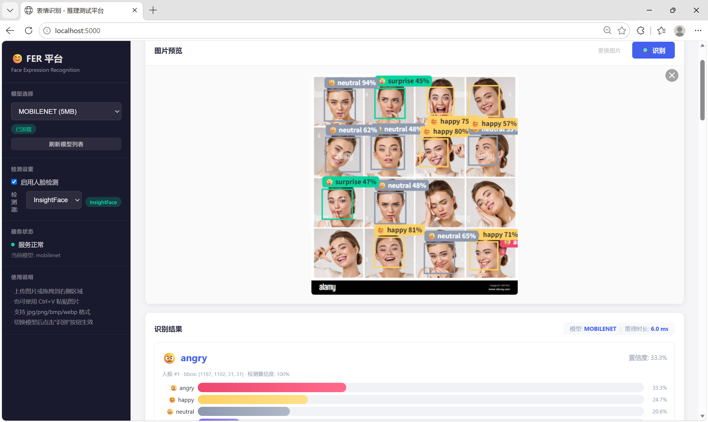

# 模块A：情感计算之人脸表情识别 — 实操手册

---

## 目录

1. [环境搭建：准备工作](#1-环境搭建准备工作)
2. [项目结构：代码结构](#2-项目结构理解每一行代码的位置)
3. [第一步：数据探索 — 认识 FER-2013](#3-第一步数据探索--认识-fer-2013)
4. [第二步：理解模型 — 四种模型对比](#4-第二步理解模型--四种架构对比)
5. [第三步：单模型训练 — 跑通第一条训练流水线](#5-第三步单模型训练--跑通第一条训练流水线)
6. [第四步：四模型对比训练 — 批量实验](#6-第四步四模型对比训练--批量实验)
7. [第五步：模型评估 — 准确率、F1、混淆矩阵](#7-第五步模型评估--准确率f1混淆矩阵)
8. [第六步：超参数调优 — 理解过拟合与正则化](#8-第六步超参数调优--理解过拟合与正则化)
9. [第七步：推理与 ONNX 导出 — 让模型"跑起来"](#9-第七步推理与-onnx-导出--让模型跑起来)
10. [第八步：API 服务化 — 把模型变成 Web 服务](#10-第八步api-服务化--把模型变成-web-服务)
11. [第九步：前端推理平台 — 可视化交互](#11-第九步前端推理平台--可视化交互)

---

## 1. 环境搭建：准备工作

### 1.1 硬件检查

> **推荐使用GPU训练**， CPU 也可以训练，但速度比较慢，可以先用 MobileNetV3（最轻量模型，CPU 上约 2~3 分钟/epoch）体验流程。

> **开发环境**， Ubuntu /Linux ; Python 3.10。

### 1.2 获取项目代码

```bash
# 下载软件包：
module_a_fer.tar.gz
# 解压到

$ mkdir -p /home/embodied/bricks/embodiedapp/module_a_fer/
$ tar -zxvf module_a_fer.tar.gz -C /home/embodied/bricks/embodiedapp/module_a_fer/

# 进入项目根目录
$ cd /home/embodied/bricks/embodiedapp/module_a_fer/module_a_fer

# 确认项目文件已完整
$ ls
```

你应该看到以下关键文件和目录：

```
face-fer/
├── train.py              ← 单模型训练入口
├── train_all.py          ← 批量训练入口
├── inference.py          ← 推理入口
├── run_api.py            ← API 服务启动入口
├── requirements.txt      ← Python 依赖清单
├── test/                 ← 验证与评估脚本
│   ├── check_deps.py         ←   依赖检查
│   ├── download_pretrained.py ←  预训练模型下载
│   ├── analyze_dataset.py    ←   数据集分析
│   └── eval_models.py        ←   模型评估
├── src/                  ← 核心源码（24 个 .py 文件）
├── configs/              ← 训练配置文件
├── dataset_data/         ← 数据集存放目录
├── frontend/             ← Web 前端（HTML/CSS/JS）
├── checkpoints/          ← 训练输出（模型权重）
├── pretrained-models/    ← ImageNet 预训练权重
├── models/               ← ONNX 推理模型 + InsightFace 人脸检测模型
├── tools/                ← 辅助脚本
└── docs/                 ← 文档
```

### 1.3 创建 Python 虚拟环境

```bash
#下载软件包：
venv.tar.gz
# 解压到


$ tar -zxvf venv.tar.gz -C /home/embodied/bricks/embodiedapp/

# 激活项目 venv 环境
source /home/embodied/bricks/embodiedapp/venv/bin/activate

# 确认 Python 版本
python --version
# 预期输出：Python 3.10.12
```

### 1.4 安装 PyTorch (线上环境跳过)

```bash
# CUDA 11.8 版本（推荐，兼容性最好）
pip install torch==2.0.1+cu118 torchvision==0.15.2+cu118 --index-url https://download.pytorch.org/whl/cu118
# 如果没有GPU
pip install torch==2.0.1 torchvision==0.15.2 -i https://pypi.tuna.tsinghua.edu.cn/simple

```


### 1.5 安装项目依赖 (线上环境跳过)

```bash

# 安装所有依赖
pip install -r requirements.txt
```

**依赖清单说明**：

| 类别 | 包名 | 用途 |
|------|------|------|
| 核心 | `numpy`, `pillow` | 数值计算、图像处理 |
| 模型 | `timm` | MobileViT 模型库 |
| 推理 | `onnx`, `onnxruntime-gpu` | 模型导出与加速推理 |
| 图像 | `opencv-python` | 图像读取与人脸检测 |
| 数据 | `pandas`, `scikit-learn` | 数据处理与评估指标 |
| Web | `flask`, `flask-cors` | API 服务 |
| 人脸 | `insightface` | 高精度人脸检测 |
| 可视化 | `matplotlib`, `seaborn` | 图表绘制 |
| 工具 | `tqdm`, `pyyaml` | 进度条、配置解析 |

### 1.6 验证环境完整性

```bash
python test/check_deps.py
```

预期输出：

```bash
(venv) embodied@embodied-virtual-machine:~/bricks/embodiedapp/module_a_fer/module_a_fer$ source /home/embodied/bricks/embodiedapp/venv/bin/activate
(venv) embodied@embodied-virtual-machine:~/bricks/embodiedapp/module_a_fer/module_a_fer$ python test/check_deps.py 
==================================================
检查项目依赖
==================================================
[OK] PyTorch: 2.0.1+cpu
[OK] timm: 1.0.28
[OK] OpenCV: 5.0.0
[OK] Pandas: 2.3.3
/home/embodied/bricks/embodiedapp/module_a_fer/module_a_fer/test/check_deps.py:26: DeprecationWarning: The '__version__' attribute is deprecated and will be removed in Flask 3.2. Use feature detection or 'importlib.metadata.version("flask")' instead.
  version = getattr(mod, '__version__', 'unknown')
[OK] Flask: 3.1.3
[OK] Flask-CORS: 6.0.5
[OK] ONNXRuntime: 1.23.2
[OK] Scikit-learn: 1.7.2
[OK] tqdm: 4.65.2
[OK] PyYAML: 6.0.3
[OK] Matplotlib: 3.10.9
==================================================
所有依赖已安装！
==================================================
(venv) embodied@embodied-virtual-machine:~/bricks/embodiedapp/module_a_fer/module_a_fer$ 

```

用VSCode打开项目，进行开发：


### 1.7 下载预训练模型权重（线上已经下载）
目前模型已经下载：
```
pretrained-models/mobilenetv3_small.pth
pretrained-models/mobilevit_xs.pth
pretrained-models/resnet50.pth
pretrained-models/vgg16.pth
```
可以自己下载，使用以下脚本进行下载：
```bash
python test/download_pretrained.py
```

这一步会从网络下载 VGG-16、ResNet-50、MobileNetV3 的 ImageNet 预训练权重到 `pretrained-models/` 目录。如果网络不好，可以跳过——训练时 PyTorch 会自动在线下载。

### 1.8 验证数据加载

这里提供了几组数据集:
## 数据集总览

| 序号 | 数据集　　　　　　　　　　　　　　　　　　　　　　| 总数量　| 类别数 | 图像格式 | 结构特点　　　　　　　　　　　　　　 |
| :----:| :--------------------------------------------------| :-------:| :------:| :--------:| :-------------------------------------|
| 1　　| [fer2013](#1-fer2013)　　　　　　　　　　　　　　 | 35,887 | 7　　　| JPG　　　| train/test 按类别分文件夹　　　　　　|
| 2　　| [fer2013_affectnet](#2-fer2013_affectnet)　　　　 | 61,732 | 7　　　| PNG+JPG　| fer2013 + AffectNet 联合，主力训练集 |
| 3　　| [RAF-DB](#3-raf-db)　　　　　　　　　　　　　　　 | 15,339 | 7　　　| JPG　　　| 数字编号(1-7)，真实场景　　　　　　　|
| 4　　| [kdef-dataset](#4-kdef-dataset)　　　　　　　　　 | 4,898　| 7　　　| JPG　　　| 标准化实验室拍摄，含 train/val/test　|
　　　　　　　　　　　　　　　　　 |
| 5　　| [FER-2013-Social media](#6-fer-2013-social-media) | 1,386　| 7　　　| JPEG　　 | 社交媒体风格，均衡小样本　　　　　　 |


本案例使用fer2013进行训练，可以查看fer2013的数据集情况，也可以使用其他数据集或组合进行训练（先解压数据集zip文件）：
```bash
python test/analyze_dataset.py
```

这会输出 FER-2013 数据集的基本统计信息（样本总数、类别分布等）。

> **如果失败**：检查 `dataset_data/fer2013/` 目录是否存在，以及目录结构是否为 `train/angry/*.jpg`。

### 1.9 验证已训练模型：启动 API 服务并测试

> **目标**：在 checkpoints 下已经训练好的四个模型，启动 Web 服务进行表情识别。  

`checkpoints/` 目录下已经包含了四个在 FER-2013 上训练完成的模型：

```
checkpoints/
├── vgg_fer2013/best_model.pth       ← VGG-16（参数量最大，准确率最高）
├── resnet_fer2013/best_model.pth    ← ResNet-50（残差学习）
├── mobilenet_fer2013/best_model.pth ← MobileNetV3-Large（轻量高效）
└── mobilevit_fer2013/best_model.pth ← MobileViT-S（CNN+Transformer 混合）
```

#### 1.9.1 启动 API 服务

```bash
# 确保在项目根目录
cd /home/embodied/bricks/embodiedapp/module_a_fer/module_a_fer

# 启动 Flask 服务
python run_api.py
```

服务启动时，`ModelManager` 会一次性将全部模型预转换为 ONNX，并初始化 InsightFace 人脸检测器：

```
发现模型: vgg -> checkpoints/vgg_fer2013/best_model.pth
发现模型: resnet -> checkpoints/resnet_fer2013/best_model.pth
发现模型: mobilenet -> checkpoints/mobilenet_fer2013/best_model.pth
发现模型: mobilevit -> checkpoints/mobilevit_fer2013/best_model.pth

开始预转换所有模型为ONNX格式...

--- 转换 vgg ---
加载PyTorch模型: checkpoints/vgg_fer2013/best_model.pth
转换为ONNX: models/fer_vgg.onnx

--- 转换 resnet ---
加载PyTorch模型: checkpoints/resnet_fer2013/best_model.pth
转换为ONNX: models/fer_resnet.onnx

--- 转换 mobilenet ---
加载PyTorch模型: checkpoints/mobilenet_fer2013/best_model.pth
转换为ONNX: models/fer_mobilenet.onnx

--- 转换 mobilevit ---
加载PyTorch模型: checkpoints/mobilevit_fer2013/best_model.pth
转换为ONNX: models/fer_mobilevit.onnx

预转换完成。
人脸检测器: InsightFace 已就绪 (模型目录: models)
已加载模型: resnet

============================================================
  表情识别服务
  管理界面: http://0.0.0.0:5000
  API文档:  http://0.0.0.0:5000/api/docs
  健康检查:  http://0.0.0.0:5000/api/health
============================================================
```

**关键机制解释**：

| 步骤 | 发生了什么 |
|:---|:---|
| `_scan_models()` | 扫描 `checkpoints/` 下所有子目录，找 `best_model.pth`；从目录名提取模型名（如 `vgg_fer2013` → `vgg`） |
| `pre_convert_all()` | **一次性**将所有 .pth 导出为 ONNX 格式到 `models/` 目录，避免切换模型时等待 |
| `init_insightface()` | 预先初始化 InsightFace 人脸检测器，确保首次请求就使用高精度方案 |
| 默认模型 | `app.config['DEFAULT_MODEL'] = 'resnet'`，如果不存在则选第一个可用模型 |

#### 1.9.2 验证服务是否正常

另开一个终端，用 curl 测试健康检查：

```bash
curl http://localhost:5000/api/health
```

预期输出：

```json
{
  "status": "healthy",
  "model_loaded": true,
  "current_model": "resnet"
}
```

查看所有可用模型：

```bash
curl http://localhost:5000/api/models
```
目前项目代码需要补全，返回如下：
```bash
embodied@embodied-virtual-machine:~/bricks/embodiedapp$ curl http://localhost:5000/api/health
{"current_model":"resnet","model_loaded":true,"status":"healthy"}
embodied@embodied-virtual-machine:~/bricks/embodiedapp$ curl http://localhost:5000/api/models
<!doctype html>
<html lang=en>
<title>500 Internal Server Error</title>
<h1>Internal Server Error</h1>
<p>The server encountered an internal error and was unable to complete your request. Either the server is overloaded or there is an error in the application.</p>
embodied@embodied-virtual-machine:~/bricks/embodiedapp$ 

```

#### 1.9.3 在浏览器中体验

打开浏览器访问 `http://localhost:5000`，你会看到 Web 前端界面：


#### 1.9.4 需求要点
- 切换4种不同的模型进行表情验证
- 切换2种检测模型(opencv\Insightface)进行人脸检测

目前代码不全，需要补充完整。

#### 1.9.5 关闭服务

在启动 `run_api.py` 的终端按 `Ctrl+C` 即可停止。

---

## 2. 项目结构：

> **目标**：在开始写代码之前，先理解整个项目的代码组织方式。  
> **说明**：对照目录树，逐个模块讲解职责。

### 2.1 完整目录树

```
face-fer/
│
├── train.py                 # [入口] 单模型训练：python train.py --config configs/xxx.json
├── train_all.py             # [入口] 批量训练：依次训练 VGG→ResNet→MobileNet→MobileViT
│
├── inference.py             # [入口] 命令行推理：单张图片 / 性能基准测试
├── run_api.py               # [入口] 启动 Flask API 服务
├── test_api.py              # [工具] API 接口测试脚本
│
├── test/                     # [验证] 中间过程验证脚本
│   ├── check_deps.py         #   依赖检查
│   ├── download_pretrained.py #  下载 ImageNet 预训练权重
│   ├── analyze_dataset.py    #   数据集统计分析
│   └── eval_models.py        #   多模型评估（混淆矩阵、F1）
│
├── configs/                 # [配置] 训练超参数
│   ├── config.py            #   配置数据结构定义（Config / DatasetConfig / ModelConfig / TrainingConfig）
│   ├── train_vgg_fer2013.json
│   ├── train_resnet_fer2013.json
│   ├── train_mobilenet_fer2013.json
│   └── train_mobilevit_fer2013.json
│
├── src/                     # [核心] 所有模块化代码
│   ├── data/                #   数据层
│   │   ├── dataset.py       #     数据集基类 FERDataset + 多数据集混合 MultiDataset
│   │   ├── fer2013.py       #     FER-2013 解析器（CSV / Kaggle 目录 / 标准目录）
│   │   ├── rafdb.py         #     RAF-DB 解析器
│   │   └── oulucasia.py     #     Oulu-CASIA 双模态（VIS+NIR）解析器
│   │
│   ├── models/              #   模型层
│   │   ├── factory.py      #     模型工厂：create_fer_model() 统一创建接口
│   │   ├── vgg.py           #     VGG-11/13/16/19
│   │   ├── resnet.py        #     ResNet-18/34/50/101/152
│   │   ├── mobilenet.py     #     MobileNetV2/V3-Small/V3-Large
│   │   └── mobilevit.py     #     MobileViT-XS/S/XXS（CNN+Transformer 混合）
│   │
│   ├── train/               #   训练层
│   │   ├── trainer.py       #     统一训练器 FERTrainer（含 early stopping / mixup / AMP）
│   │   └── losses.py        #     FocalLoss + LabelSmoothingLoss
│   │
│   ├── inference/           #   推理层
│   │   ├── inferrer.py      #     ONNX 推理器
│   │   ├── detector.py      #     人脸检测（InsightFace / OpenCV / MTCNN，默认为 InsightFace）
│   │   └── export.py        #     PyTorch → ONNX 导出
│   │
│   └── api/                 #   服务层
│       ├── app.py           #     Flask 应用创建
│       ├── routes.py        #     API 路由（/api/recognize, /api/models 等）
│       └── model_manager.py #     模型管理（自动扫描 checkpoints、ONNX 转换）
│
├── frontend/                # [前端] Web 推理测试平台
│   ├── index.html           #   页面结构
│   ├── style.css            #   样式
│   └── app.js               #   交互逻辑（上传、识别、结果展示）
│
├── models/                  # [模型] ONNX 推理模型 + InsightFace 人脸检测模型
│   ├── fer_vgg.onnx         #   VGG ONNX 导出
│   ├── fer_resnet.onnx      #   ResNet ONNX 导出
│   ├── fer_mobilenet.onnx   #   MobileNet ONNX 导出
│   ├── fer_mobilevit.onnx   #   MobileViT ONNX 导出
│   └── buffalo_l/           #   InsightFace 人脸检测模型（首次启动自动下载）
│
├── tools/                   # [工具] 辅助脚本
│   └── download_insightface_model.py  #   InsightFace 模型手动下载工具
│
├── dataset_data/            # [数据] 数据集文件
│   └── fer2013/             #   FER-2013（train/test 按类别分目录）
│       ├── train/
│       │   ├── angry/       (3995 张)
│       │   ├── disgust/     (436 张)
│       │   ├── fear/        (4097 张)
│       │   ├── happy/       (7215 张)
│       │   ├── sad/         (4830 张)
│       │   ├── surprise/    (3171 张)
│       │   └── neutral/     (4965 张)
│       └── test/
│           └── ...          (7178 张，同类结构)
│
├── checkpoints/             # [输出] 训练产出
│   ├── vgg_fer2013/
│   ├── resnet_fer2013/
│   ├── mobilenet_fer2013/
│   └── mobilevit_fer2013/
│       └── <timestamp>/     #   每次运行的独立目录
│           ├── best_model.pth       ← 最佳模型权重
│           ├── checkpoint_epoch_10.pth  ← 定期保存
│           ├── config.json          ← 训练配置存档
│           └── history.json         ← 训练历史（每轮 loss/acc/lr）
│
├── pretrained-models/       # [预训练] ImageNet 权重缓存
│   ├── vgg16.pth
│   ├── resnet50.pth
│   ├── mobilenetv3_small.pth
│   └── mobilevit_xs.pth
│
└── docs/                    # [文档]
    ├── 01 模块A 情感计算之人脸表情识别-实操手册.md  ← 当前文件
    ├── 02 模块A 情感计算之人脸表情识别-技术架构.md
    ├── 04 模块A 情感计算之人脸表情识别-预训练模型说明.md
    └── 05 模型训练报告.md
```

### 2.2 数据流全景图

```
[数据准备]                    [模型定义]                   [训练]                     [评估/部署]

dataset_data/fer2013/        src/models/                  src/train/                 checkpoints/
    │                            │                            │                          │
    ├─ train/angry/*.jpg         ├─ vgg.py                   ├─ trainer.py              ├─ best_model.pth
    ├─ train/happy/*.jpg         ├─ resnet.py                │   ├─ FocalLoss           │
    ├─ ...                       ├─ mobilenet.py             │   ├─ MixUp               │
    └─ test/angry/*.jpg          └─ mobilevit.py             │   ├─ EarlyStopping       │
        │                            │                       │   ├─ AMP混合精度          │
        ▼                            ▼                       │   └─ CosineAnnealing     │
src/data/fer2013.py           factory.py                     │       WarmRestarts        │
├─ FER2013Dataset             └─ create_fer_model()          │                          │
│   ├─ _load_from_directory                                   ▼                          ▼
│   ├─ _get_transforms()                                train.py                   inference.py
│   └─ __getitem__()                                    ├─ 加载config              ├─ PyTorch→ONNX
        │                                               ├─ 创建数据加载器           ├─ 单张推理
        ▼                                               ├─ 创建FERTrainer          └─ 性能基准测试
DataLoader                                              ├─ trainer.train()
├─ batch_size=32                                        └─ trainer.test()          run_api.py
├─ shuffle=True                                                                     ├─ Flask 服务
└─ num_workers=4                                            │                       ├─ /api/recognize
                                                            ▼                       ├─ /api/models
                                                     checkpoints/xxx/               └─ /api/health
                                                     ├─ best_model.pth
                                                     ├─ history.json                frontend/
                                                     └─ config.json                 └─ index.html + app.js
```

### 2.3 关键设计模式

| 模式 | 文件 | 说明 |
|------|------|------|
| **工厂模式** | `src/models/factory.py` | `create_fer_model('resnet', 'resnet50')` 统一创建不同架构 |
| **策略模式** | `src/train/losses.py` | FocalLoss / LabelSmoothing / CrossEntropy 可插拔 |
| **配置驱动** | `configs/*.json` → `configs/config.py` | JSON 配置文件 → dataclass 对象，训练参数不需改代码 |
| **适配器模式** | `src/data/fer2013.py` | 统一接口适配 CSV / Kaggle 目录 / 标准目录三种数据格式 |

---

## 3. 第一步：数据探索 — 认识 FER-2013

### 3.1 运行数据探索脚本

```bash
python test/analyze_dataset.py
```

**你会看到的输出（关键片段）**：

```
============================================================
数据集分析报告
============================================================

【数据集】fer2013
----------------------------------------
目录结构:
├── train/
│   ├── angry/
│   ├── disgust/
│   ├── fear/
│   ├── happy/
│   ├── sad/
│   ├── surprise/
│   └── neutral/
└── test/
    └── ... (同类结构)

文件统计:
  总文件数: 35887
  文件类型:
    .jpg: 35887

数据集划分:
  train: 28709 张图像
    angry: 3995
    disgust: 436
    fear: 4097
    happy: 7215
    sad: 4830
    surprise: 3171
    neutral: 4965
  test: 7178 张图像
    angry: 958
    disgust: 111
    fear: 1024
    happy: 1774
    sad: 1247
    surprise: 831
    neutral: 1233
```

### 3.2 数据集关键特征

**FER-2013（Facial Expression Recognition 2013）**：

| 属性 | 值 |
|------|-----|
| 来源 | ICML 2013 Workshop 挑战赛 |
| 原始图像 | 48×48 像素，灰度图 |
| 图像特点 | Google 图片搜索采集，含水印/文字/卡通/多面孔 |
| 标注方式 | 人工标注（人类一致性约 65%） |
| 总样本 | 35,887 张 |
| 类别数 | 7 类 |

**7 类表情分布**：

| 索引 | 表情 | 英文 | 训练集 | 占比 | 测试集 |
|:---:|:---|:---|------:|-----:|------:|
| 0 | 愤怒 | Angry | 3,995 | 13.9% | 958 |
| 1 | 厌恶 | Disgust | **436** | **1.5%** ⚠️ | 111 |
| 2 | 恐惧 | Fear | 4,097 | 14.3% | 1,024 |
| 3 | 快乐 | Happy | 7,215 | 25.1% | 1,774 |
| 4 | 悲伤 | Sad | 4,830 | 16.8% | 1,247 |
| 5 | 惊讶 | Surprise | 3,171 | 11.0% | 831 |
| 6 | 中性 | Neutral | 4,965 | 17.3% | 1,233 |

> ⚠️ **关键问题**：Disgust（厌恶）只有 436 张训练样本，是 Happy 的 1/16。这是**典型的类别不平衡问题**，将在训练阶段通过 Focal Loss 和 MixUp 来缓解。

### 3.3 理解数据预处理流水线

打开 `src/data/fer2013.py`，找到 `_get_transforms()` 方法：

```python
def _get_transforms(self) -> transforms.Compose:
    transform_list = []

    # ── 训练集独有的数据增强 ──
    if self.use_augmentation and self.split == 'train':
        transform_list.extend([
            transforms.RandomHorizontalFlip(p=0.5),     # 50% 概率水平翻转
            transforms.RandomRotation(degrees=15),       # 随机旋转 ±15°
            transforms.ColorJitter(brightness=0.2,       # 亮度 ±20%
                                   contrast=0.2,         # 对比度 ±20%
                                   saturation=0.2,       # 饱和度 ±20%
                                   hue=0.1),             # 色相 ±10%
            transforms.RandomAffine(degrees=10,          # 随机仿射变换 ±10°
                                    translate=(0.1, 0.1), # 平移 ±10%
                                    scale=(0.9, 1.1)),   # 缩放 0.9~1.1 倍
        ])

    # ── 训练和测试共有 ──
    transform_list.append(transforms.Resize((224, 224)))   # 调整为 224×224

    # ── 转为 Tensor + ImageNet 标准化 ──
    transform_list.extend([
        transforms.ToTensor(),
        transforms.Normalize(mean=[0.485, 0.456, 0.406],
                             std=[0.229, 0.224, 0.225])
    ])

    return transforms.Compose(transform_list)
```

**每一步的含义**：

```
原始图像 (48×48 灰度)
    │
    ▼ RandomHorizontalFlip(p=0.5)    ← 增加左右对称不变性
    ▼ RandomRotation(15°)            ← 增加旋转鲁棒性
    ▼ ColorJitter                    ← 增加光照不变性
    ▼ RandomAffine                   ← 增加几何不变性
    │
    ▼ Resize(224×224)                ← 匹配 ImageNet 预训练模型输入尺寸
    │
    ▼ ToTensor()                     ← PIL Image → torch.Tensor [0,1]
    │
    ▼ Normalize(ImageNet统计量)       ← 匹配预训练模型的数据分布
    │
    └── [3, 224, 224] Tensor
```

### 3.4 动手任务

1. **修改数据增强参数**：打开 `src/data/fer2013.py`，将 `RandomRotation` 的 `degrees` 从 15 改为 30，重新运行 `python test/analyze_dataset.py`，观察数据统计是否正常。

2. **自建数据探索脚本**：编写一个简短的 Python 脚本，使用 `matplotlib` 随机展示训练集中每个类别的 5 张图片（共 35 张），观察各类别的图像质量差异。

3. **思考题**：
   - FER-2013 的原始图像只有 48×48，训练时 Resize 到 224×224。放大将近 5 倍会产生什么问题？
   - 如果让你来解决 Disgust 类别样本过少的问题，你能想到哪些方法？

---

## 4. 第二步：理解模型 — 四种架构对比

### 4.1 四种架构一览

| 特性 | VGG-16 | ResNet-50 | MobileNetV3-Small | MobileViT-XS |
|:---|:---|:---|:---|:---|
| **核心思想** | 3×3 卷积堆叠 | 残差连接（跳跃连接） | 深度可分离卷积 + SE | CNN + Transformer 混合 |
| **参数量** | ~135M | ~25M | ~2.5M | ~2.3M |
| **模型文件大小** | ~512 MB | ~90 MB | ~5 MB | ~7.5 MB |
| **层数** | 16 层 | 50 层 | ~15 层 | ~20 层 |
| **设计年代** | 2014 | 2015 | 2019 | 2022 |
| **推理速度** | 慢 | 中等 | 快 | 较快 |
| **部署场景** | 学术基准 | 通用高精度 | 移动端/边缘 | 移动端实时（推荐） |

### 4.2 各模型核心代码位置

```bash
# 查看 VGG 定义
cat src/models/vgg.py

# 查看 ResNet 定义
cat src/models/resnet.py

# 查看 MobileNet 定义
cat src/models/mobilenet.py

# 查看 MobileViT 定义
cat src/models/mobilevit.py

# 查看模型工厂（统一创建接口）
cat src/models/factory.py
```

### 4.3 模型工厂的使用

打开 `src/models/factory.py`，核心接口：

```python
from src.models.factory import create_fer_model

# 一行代码创建任意模型
model = create_fer_model(
    model_type='resnet',          # 'vgg' / 'resnet' / 'mobilenet' / 'mobilevit'
    model_name='resnet50',        # 具体变体
    num_classes=7,                # 7 类表情
    pretrained=True,              # 使用 ImageNet 预训练权重
    dropout_rate=0.2              # Dropout 比例
)

# 打印模型信息
from src.models.factory import print_model_info
print_model_info(model, 'resnet', 'resnet50')
```

### 4.4 动手任务

1. **计算并对比参数量**：使用 `src/models/factory.py` 中的 `count_parameters()` 函数，打印四个模型的参数量和文件大小，填写下表：

| 模型 | 参数量 | 我的实测值 |
|:---|:---|:---|
| VGG-16 | ~135M | 134.29M|
| ResNet-50 | ~25M | 23.52M|
| MobileNetV3-Small | ~2.5M | 1.26M|
| MobileViT-XS | ~2.3M | 1.94M|

---

## 5. 第三步：单模型训练 — 跑通第一条训练流水线

### 5.0 补全训练器代码

先打开 `src/train/trainer.py`，将 TODO 替换为以下代码，再开始训练：

```python
"""
表情识别统一训练器
支持VGG、ResNet、MobileNet、MobileViT四种模型
"""

import os
import torch
import torch.nn as nn
import torch.optim as optim
from torch.utils.data import DataLoader
from torch.cuda.amp import autocast, GradScaler
from tqdm import tqdm
import time
import json
import numpy as np
from typing import Dict, Optional, List, Tuple
from dataclasses import dataclass, asdict

from src.models.factory import create_fer_model, save_model, print_model_info, count_parameters


@dataclass
class TrainingConfig:
    """训练配置"""
    # 模型配置
    model_type: str = 'mobilevit'
    model_name: str = 'mobilevit_xs'
    num_classes: int = 7
    pretrained: bool = True
    dropout_rate: float = 0.2
    
    # 训练配置
    epochs: int = 100
    batch_size: int = 64
    num_workers: int = 4
    
    # 优化器配置
    optimizer_type: str = 'AdamW'
    lr: float = 3e-4
    weight_decay: float = 1e-5
    momentum: float = 0.9  # SGD使用
    
    # 学习率调度
    scheduler_type: str = 'CosineAnnealingWarmRestarts'
    warmup_epochs: int = 5
    T_0: int = 20  # CosineAnnealingWarmRestarts
    T_mult: int = 2
    eta_min: float = 1e-6
    
    # 损失函数
    label_smoothing: float = 0.1
    use_focal_loss: bool = False
    focal_alpha: float = 0.25
    focal_gamma: float = 2.0
    
    # 正则化
    grad_clip: float = 1.0
    mixup_alpha: float = 0.2
    cutmix_alpha: float = 1.0
    
    # 早停
    early_stop_patience: int = 0  # 0=禁用, N=val_acc连续N个epoch不提升即停止
    
    # 其他
    seed: int = 42
    device: str = 'cuda'
    use_amp: bool = True  # 混合精度训练
    save_dir: str = 'checkpoints'
    log_interval: int = 10
    save_interval: int = 10  # 定期保存间隔，避免大模型频繁写盘
    keep_checkpoint_max: int = 5  # 最多保留定期checkpoint数量，超出自动删除旧的


class FERTrainer:
    """
    表情识别统一训练器
    """
    
    # 表情类别
    EXPRESSION_LABELS = ['angry', 'disgust', 'fear', 'happy', 'sad', 'surprise', 'neutral']
    
    def __init__(
        self,
        config: TrainingConfig,
        train_loader: DataLoader,
        val_loader: Optional[DataLoader] = None,
        test_loader: Optional[DataLoader] = None
    ):
        """
        初始化训练器
        
        Args:
            config: 训练配置
            train_loader: 训练数据加载器
            val_loader: 验证数据加载器
            test_loader: 测试数据加载器
        """
        self.config = config
        self.train_loader = train_loader
        self.val_loader = val_loader
        self.test_loader = test_loader
        
        # 设置随机种子
        self._set_seed(config.seed)
        
        # 设置设备
        self.device = torch.device(config.device if torch.cuda.is_available() else 'cpu')
        print(f"使用设备: {self.device}")
        
        # 创建模型
        self.model = create_fer_model(
            model_type=config.model_type,
            model_name=config.model_name,
            num_classes=config.num_classes,
            pretrained=config.pretrained,
            dropout_rate=config.dropout_rate
        )
        self.model.to(self.device)
        
        # 打印模型信息
        print_model_info(self.model, config.model_type, config.model_name)
        
        # 创建损失函数
        self.criterion = self._create_criterion()
        
        # 创建优化器
        self.optimizer = self._create_optimizer()
        
        # 创建学习率调度器
        self.scheduler = self._create_scheduler()
        
        # 混合精度训练
        self.scaler = GradScaler() if config.use_amp and self.device.type == 'cuda' else None
        
        # 训练历史
        self.history = {
            'train_loss': [],
            'train_acc': [],
            'val_loss': [],
            'val_acc': [],
            'lr': []
        }
        
        # 最佳模型
        self.best_acc = 0.0
        self.best_epoch = 0
        
        # 早停计数器
        self.early_stop_counter = 0
        
        # 创建保存目录
        os.makedirs(config.save_dir, exist_ok=True)
        
        # 保存配置
        config_path = os.path.join(config.save_dir, 'config.json')
        with open(config_path, 'w') as f:
            json.dump(asdict(config), f, indent=2)
    
    def _set_seed(self, seed: int):
        """设置随机种子"""
        torch.manual_seed(seed)
        torch.cuda.manual_seed_all(seed)
        np.random.seed(seed)
    
    def _create_criterion(self) -> nn.Module:
        """创建损失函数"""
        if self.config.use_focal_loss:
            from .losses import FocalLoss
            return FocalLoss(
                alpha=self.config.focal_alpha,
                gamma=self.config.focal_gamma,
                num_classes=self.config.num_classes
            )
        else:
            return nn.CrossEntropyLoss(label_smoothing=self.config.label_smoothing)
    
    def _create_optimizer(self) -> optim.Optimizer:
        """创建优化器"""
        if self.config.optimizer_type == 'Adam':
            return optim.Adam(
                self.model.parameters(),
                lr=self.config.lr,
                weight_decay=self.config.weight_decay
            )
        elif self.config.optimizer_type == 'AdamW':
            return optim.AdamW(
                self.model.parameters(),
                lr=self.config.lr,
                weight_decay=self.config.weight_decay
            )
        elif self.config.optimizer_type == 'SGD':
            return optim.SGD(
                self.model.parameters(),
                lr=self.config.lr,
                momentum=self.config.momentum,
                weight_decay=self.config.weight_decay
            )
        else:
            raise ValueError(f"不支持的优化器: {self.config.optimizer_type}")
    
    def _create_scheduler(self) -> Optional[optim.lr_scheduler._LRScheduler]:
        """创建学习率调度器"""
        if self.config.scheduler_type == 'StepLR':
            return optim.lr_scheduler.StepLR(
                self.optimizer,
                step_size=20,
                gamma=0.1
            )
        elif self.config.scheduler_type == 'CosineAnnealingLR':
            return optim.lr_scheduler.CosineAnnealingLR(
                self.optimizer,
                T_max=self.config.epochs,
                eta_min=self.config.eta_min
            )
        elif self.config.scheduler_type == 'CosineAnnealingWarmRestarts':
            return optim.lr_scheduler.CosineAnnealingWarmRestarts(
                self.optimizer,
                T_0=self.config.T_0,
                T_mult=self.config.T_mult,
                eta_min=self.config.eta_min
            )
        elif self.config.scheduler_type == 'LinearWarmup':
            # 需要自定义warmup
            return None
        else:
            return None
    
    def _warmup_scheduler(self, epoch: int):
        """Warmup学习率调整"""
        if epoch < self.config.warmup_epochs:
            warmup_lr = self.config.lr * (epoch + 1) / self.config.warmup_epochs
            for param_group in self.optimizer.param_groups:
                param_group['lr'] = warmup_lr
    
    def train_epoch(self, epoch: int) -> Dict[str, float]:
        """训练一个epoch"""
        self.model.train()
        
        total_loss = 0.0
        correct = 0
        total = 0
        
        pbar = tqdm(self.train_loader, desc=f'Epoch {epoch} [Train]')
        
        for batch_idx, data in enumerate(pbar):
            # 处理不同数据集的返回格式
            # DataLoader可能返回list或tuple
            if isinstance(data, (tuple, list)):
                if len(data) == 3:
                    images, labels, _ = data  # MultiDataset返回 (image, label, dataset_idx)
                else:
                    images, labels = data  # 普通数据集返回 (image, label)
            else:
                images, labels = data  # 备用处理
            

            
            # 确保labels是Tensor
            if not isinstance(labels, torch.Tensor):
                # 如果是tuple或list，转换为Tensor
                if isinstance(labels, (tuple, list)):
                    # 检查是否是mixup格式 (y_a, y_b, lam)
                    if len(labels) == 3 and isinstance(labels[2], (float, torch.Tensor)):
                        # 这是mixup格式，但我们没有启用mixup，所以只取第一个label
                        labels = labels[0]
                    else:
                        labels = torch.tensor(labels)
                else:
                    labels = torch.tensor(labels)
            
            images = images.to(self.device)
            
            # 确保labels是Tensor并且在正确的设备上
            if isinstance(labels, torch.Tensor):
                labels = labels.to(self.device)
            else:
                # 最后的安全检查
                labels = torch.tensor(labels).to(self.device)
            
            # Mixup/CutMix（可选）
            if self.config.mixup_alpha > 0 and np.random.rand() < 0.5:
                images, labels = self._mixup(images, labels)
            
            # 前向传播
            self.optimizer.zero_grad()
            
            if self.scaler is not None:
                with autocast():
                    outputs = self.model(images)
                    loss = self.criterion(outputs, labels)
                
                # 反向传播
                self.scaler.scale(loss).backward()
                
                # 梯度裁剪
                if self.config.grad_clip > 0:
                    self.scaler.unscale_(self.optimizer)
                    torch.nn.utils.clip_grad_norm_(self.model.parameters(), self.config.grad_clip)
                
                self.scaler.step(self.optimizer)
                self.scaler.update()
            else:
                outputs = self.model(images)
                loss = self.criterion(outputs, labels)
                
                loss.backward()
                
                if self.config.grad_clip > 0:
                    torch.nn.utils.clip_grad_norm_(self.model.parameters(), self.config.grad_clip)
                
                self.optimizer.step()
            
            # 统计
            total_loss += loss.item()
            
            # 计算准确率（Mixup时需要特殊处理）
            if isinstance(labels, tuple):  # Mixup
                _, predicted = outputs.max(1)
                total += labels[0].size(0)
                correct += (predicted == labels[0]).sum().item() * labels[2]
                correct += (predicted == labels[1]).sum().item() * (1 - labels[2])
            else:
                _, predicted = outputs.max(1)
                total += labels.size(0)
                correct += predicted.eq(labels).sum().item()
            
            # 更新进度条
            current_lr = self.optimizer.param_groups[0]['lr']
            pbar.set_postfix({
                'loss': total_loss / (batch_idx + 1),
                'acc': 100. * correct / total,
                'lr': current_lr
            })
        
        return {
            'loss': total_loss / len(self.train_loader),
            'acc': 100. * correct / total
        }
    
    def _mixup(self, images: torch.Tensor, labels: torch.Tensor) -> Tuple:
        """Mixup数据增强"""
        alpha = self.config.mixup_alpha
        lam = np.random.beta(alpha, alpha)
        
        batch_size = images.size(0)
        index = torch.randperm(batch_size).to(self.device)
        
        mixed_images = lam * images + (1 - lam) * images[index]
        labels_a, labels_b = labels, labels[index]
        
        return mixed_images, (labels_a, labels_b, lam)
    
    def validate(self, loader: DataLoader, desc: str = 'Val') -> Dict[str, float]:
        """验证模型"""
        self.model.eval()
        
        total_loss = 0.0
        correct = 0
        total = 0
        
        # 各类别准确率
        class_correct = np.zeros(self.config.num_classes)
        class_total = np.zeros(self.config.num_classes)
        
        with torch.no_grad():
            for data in tqdm(loader, desc=f'[{desc}]'):
                # 处理不同数据集的返回格式
                if isinstance(data, tuple) and len(data) == 3:
                    images, labels, _ = data
                else:
                    images, labels = data
                
                images = images.to(self.device)
                labels = labels.to(self.device)
                
                outputs = self.model(images)
                loss = self.criterion(outputs, labels)
                
                total_loss += loss.item()
                _, predicted = outputs.max(1)
                total += labels.size(0)
                correct += predicted.eq(labels).sum().item()
                
                # 各类别统计
                for i in range(self.config.num_classes):
                    class_total[i] += (labels == i).sum().item()
                    class_correct[i] += ((predicted == i) & (labels == i)).sum().item()
        
        # 各类别准确率
        class_acc = class_correct / class_total * 100
        
        return {
            'loss': total_loss / len(loader),
            'acc': 100. * correct / total,
            'class_acc': class_acc
        }
    
    def train(self) -> float:
        """完整训练流程"""
        print("\n" + "=" * 50)
        print(f"开始训练: {self.config.model_type}/{self.config.model_name}")
        print("=" * 50)
        
        start_time = time.time()
        
        for epoch in range(1, self.config.epochs + 1):
            epoch_start = time.time()
            
            # Warmup
            if epoch <= self.config.warmup_epochs:
                self._warmup_scheduler(epoch)
            
            # 训练
            train_metrics = self.train_epoch(epoch)
            
            # 验证
            if self.val_loader is not None:
                val_metrics = self.validate(self.val_loader, 'Val')
            else:
                val_metrics = {'loss': 0, 'acc': 0, 'class_acc': np.zeros(self.config.num_classes)}
            
            # 更新学习率
            if self.scheduler is not None and epoch > self.config.warmup_epochs:
                self.scheduler.step()
            
            # 记录历史
            current_lr = self.optimizer.param_groups[0]['lr']
            self.history['train_loss'].append(train_metrics['loss'])
            self.history['train_acc'].append(train_metrics['acc'])
            self.history['val_loss'].append(val_metrics['loss'])
            self.history['val_acc'].append(val_metrics['acc'])
            self.history['lr'].append(current_lr)
            
            epoch_time = time.time() - epoch_start
            
            # 打印结果
            print(f"\nEpoch {epoch}/{self.config.epochs}")
            print(f"  Train Loss: {train_metrics['loss']:.4f}, Train Acc: {train_metrics['acc']:.2f}%")
            if self.val_loader is not None:
                print(f"  Val Loss: {val_metrics['loss']:.4f}, Val Acc: {val_metrics['acc']:.2f}%")
            print(f"  LR: {current_lr:.6f}, Time: {epoch_time:.1f}s")
            
            # 保存最佳模型
            if val_metrics['acc'] > self.best_acc:
                self.best_acc = val_metrics['acc']
                self.best_epoch = epoch
                self.early_stop_counter = 0  # 重置早停计数器
                
                save_path = os.path.join(self.config.save_dir, 'best_model.pth')
                save_model(
                    self.model,
                    save_path,
                    self.config.model_type,
                    self.config.model_name,
                    optimizer=self.optimizer,
                    epoch=epoch,
                    best_acc=self.best_acc,
                    include_optimizer=False,  # best_model 仅推理用，不需优化器状态
                    history=self.history
                )
                print(f"  [SAVED] 保存最佳模型 (Acc: {self.best_acc:.2f}%)")
            else:
                self.early_stop_counter += 1
            
            # 早停检查
            patience = self.config.early_stop_patience
            if patience > 0 and self.early_stop_counter >= patience:
                print(f"\n  [EARLY STOP] Val Acc 连续 {patience} 个 epoch 未提升，停止训练")
                print(f"  最佳 Acc: {self.best_acc:.2f}% (Epoch {self.best_epoch})")
                break
            
            # 定期保存 + 自动清理旧checkpoint
            if epoch % self.config.save_interval == 0:
                save_path = os.path.join(self.config.save_dir, f'checkpoint_epoch_{epoch}.pth')
                save_model(
                    self.model,
                    save_path,
                    self.config.model_type,
                    self.config.model_name,
                    optimizer=self.optimizer,
                    epoch=epoch,
                    best_acc=self.best_acc,
                    include_optimizer=True  # 定期 checkpoint 保留优化器状态用于恢复训练
                )
                # 自动清理旧checkpoint，只保留最近 N 个
                self._cleanup_old_checkpoints()
        
        total_time = time.time() - start_time
        
        print("\n" + "=" * 50)
        print(f"训练完成!")
        print(f"  最佳准确率: {self.best_acc:.2f}% (Epoch {self.best_epoch})")
        print(f"  总训练时间: {total_time / 60:.1f} 分钟")
        print("=" * 50)
        
        # 保存训练历史
        history_path = os.path.join(self.config.save_dir, 'history.json')
        with open(history_path, 'w') as f:
            json.dump(self.history, f, indent=2)
        
        return self.best_acc
    
    def _cleanup_old_checkpoints(self):
        """自动清理旧的定期checkpoint，只保留最近 keep_checkpoint_max 个"""
        if self.config.keep_checkpoint_max <= 0:
            return  # 0 或负数 = 不限制
        
        import glob
        pattern = os.path.join(self.config.save_dir, 'checkpoint_epoch_*.pth')
        files = glob.glob(pattern)
        
        if len(files) <= self.config.keep_checkpoint_max:
            return
        
        # 按 epoch 号排序（从文件名提取数字）
        def extract_epoch(filepath):
            import re
            match = re.search(r'checkpoint_epoch_(\d+)\.pth', filepath)
            return int(match.group(1)) if match else 0
        
        files.sort(key=extract_epoch)
        
        # 删除最旧的，保留最近 keep_checkpoint_max 个
        to_delete = files[:-self.config.keep_checkpoint_max]
        for f in to_delete:
            try:
                os.remove(f)
                print(f"  [CLEANUP] 已删除旧checkpoint: {os.path.basename(f)}")
            except OSError as e:
                print(f"  [WARN] 删除失败: {os.path.basename(f)} - {e}")
    
    def test(self) -> Dict[str, float]:
        """测试模型"""
        if self.test_loader is None:
            print("未提供测试数据")
            return {}
        
        print("\n测试最佳模型...")
        
        # 加载最佳模型
        best_path = os.path.join(self.config.save_dir, 'best_model.pth')
        if os.path.exists(best_path):
            checkpoint = torch.load(best_path, map_location=self.device)
            self.model.load_state_dict(checkpoint['model_state_dict'])
        
        test_metrics = self.validate(self.test_loader, 'Test')
        
        print(f"\n测试结果:")
        print(f"  Loss: {test_metrics['loss']:.4f}")
        print(f"  Accuracy: {test_metrics['acc']:.2f}%")
        print(f"\n各类别准确率:")
        for i, label in enumerate(self.EXPRESSION_LABELS):
            print(f"  {label}: {test_metrics['class_acc'][i]:.2f}%")
        
        return test_metrics
```

### 5.1 训练命令

```bash

# 先从最轻量的 MobileNetV3 开始（该模型最快，约 15~20 分钟完成，默认 50 epoch）

# 为先测试补充代码，可以先修改训练epoch为1次：
# 打开train_mobilenet_fer2013.json
#  "epochs": 50, 改为  "epochs": 1,

python train.py --config configs/train_mobilenet_fer2013.json
```
输出
```bash

(venv) embodied@embodied-virtual-machine:~/bricks/embodiedapp/module_a_fer/module_a_fer$ python train.py --config configs/train_mobilenet_fer2013.json 
加载配置文件: configs/train_mobilenet_fer2013.json
============================================================
表情识别模型训练
============================================================
配置文件: configs/train_mobilenet_fer2013.json
模型: mobilenet/mobilenetv3_small
数据集: fer2013
数据集目录: dataset_data/fer2013
------------------------------------------------------------
训练轮数: 1
批大小: 32
学习率: 0.0003
优化器: AdamW
权重衰减: 0.0001
混合精度: 开启
预训练权重: 使用
模型保存目录: checkpoints/mobilenet_fer2013
============================================================

加载数据集...
FER-2013 train: 28709 张图像
FER-2013 test: 7178 张图像
使用设备: cpu

模型信息:
  类型: mobilenet
  名称: mobilenetv3_small
  参数量: 1.26M
  输入尺寸: 224x224
  预处理: mean=[0.485, 0.456, 0.406], std=[0.229, 0.224, 0.225]

==================================================
开始训练: mobilenet/mobilenetv3_small
==================================================
Epoch 1 [Train]:   2%|▉                                                        | 15/897 [00:15<14:37,  1.00it/s, loss=0.343, acc=19.6, lr=0.00012]

```

### 5.2 训练过程解读

训练启动时你会看到：

```
============================================================
表情识别模型训练
============================================================
配置文件: configs/train_mobilenet_fer2013.json
模型: mobilenet/mobilenetv3_small
数据集: fer2013
数据集目录: dataset_data/fer2013
------------------------------------------------------------
训练轮数: 50
批大小: 32
学习率: 0.0003
优化器: AdamW
权重衰减: 0.0001
混合精度: 开启
预训练权重: 使用
模型保存目录: checkpoints/mobilenet_fer2013
============================================================

加载数据集...
FER-2013 train: 28709 张图像
FER-2013 test: 7178 张图像
```

训练过程中，每个 epoch 的输出格式：

```
Epoch 12/50
  Train Loss: 0.8523, Train Acc: 76.45%
  Val Loss: 1.1234, Val Acc: 65.32%
  LR: 0.000245, Time: 45.2s
```

**每个字段的含义**：

| 字段 | 含义 | 理想趋势 |
|------|------|---------|
| `Train Loss` | 训练集上的损失值 | 持续下降 ↓ |
| `Train Acc` | 训练集准确率 | 上升后趋于稳定 |
| `Val Loss` | 验证集损失值 | 先降后升 → 过拟合信号 ⚠️ |
| `Val Acc` | 验证集准确率 | 先升后持平 → 收敛 |
| `LR` | 当前学习率 | 按调度器规律变化 |
| `Time` | 本 epoch 耗时 | 基本稳定 |

### 5.3 训练配置文件详解

打开 `configs/train_mobilenet_fer2013.json`：

```json
{
  "dataset": {
    "name": "fer2013",                    // 数据集名称
    "root_dir": "dataset_data/fer2013",   // 数据集路径
    "split": "train",                     // 训练模式
    "image_size": 224,                    // 输入尺寸（匹配 ImageNet 预训练）
    "use_augmentation": true              // 启用数据增强
  },
  "model": {
    "type": "mobilenet",                  // 模型类型
    "name": "mobilenetv3_small",          // 具体变体
    "num_classes": 7,                     // 输出类别数
    "pretrained": true,                   // 使用 ImageNet 预训练（关键！）
    "dropout_rate": 0.2                   // Dropout 比例
  },
  "training": {
    "epochs": 50,                         // 最大训练轮数
    "batch_size": 32,                     // 批次大小
    "num_workers": 4,                     // 数据加载线程数
    "optimizer": "AdamW",                 // 优化器类型
    "lr": 3e-4,                           // 初始学习率
    "weight_decay": 1e-4,                 // L2 正则化系数
    "scheduler": "CosineAnnealingWarmRestarts",  // 学习率调度器
    "warmup_epochs": 5,                   // 预热 epoch 数
    "T_0": 25,                            // 余弦退火初始周期
    "T_mult": 2,                          // 每周期的倍增因子
    "eta_min": 1e-6,                      // 最小学习率
    "label_smoothing": 0.1,               // 标签平滑系数
    "use_focal_loss": true,               // 使用 Focal Loss
    "mixup_alpha": 0.2,                   // MixUp 增强强度
    "early_stop_patience": 15,            // 早停耐心值（连续15轮不涨即停止）
    "seed": 42,                           // 随机种子（可复现）
    "use_amp": true,                      // 自动混合精度训练
    "grad_clip": 1.0,                     // 梯度裁剪阈值
    "save_dir": "checkpoints/mobilenet_fer2013",  // 模型保存目录
    "save_interval": 10,                  // 每 N 个 epoch 保存一次
    "keep_checkpoint_max": 5              // 最多保留 N 个定期 checkpoint
  }
}
```

### 5.4 训练产物解读

训练完成后，在 `checkpoints/mobilenet_fer2013/<timestamp>/` 下会生成：

| 文件 | 内容 |
|------|------|
| `best_model.pth` | 验证集准确率最高的模型权重 |
| `checkpoint_epoch_10.pth` | 第 10 epoch 的模型快照（用于恢复训练） |
| `checkpoint_epoch_20.pth` | 第 20 epoch 的模型快照 |
| `config.json` | 本次训练的完整配置（可复现） |
| `history.json` | 每个 epoch 的 loss/acc/lr 数据（可绘图） |

**查看训练历史**：

```bash
# 查看 history.json 的最后几行
python -c "import json; ts=sorted(__import__('os').listdir('checkpoints/mobilenet_fer2013'))[-1]; data=json.load(open(f'checkpoints/mobilenet_fer2013/{ts}/history.json')); [print(f'Epoch {d[\"epoch\"]:>3}: Train Acc={d[\"train_acc\"]:.2f}%, Val Acc={d[\"val_acc\"]:.2f}%, Val Loss={d[\"val_loss\"]:.4f}') for d in data]"
```

### 5.5 训练中的过拟合诊断

| 现象 | 诊断 | 原因 | 对策 |
|:---|:---|:---|:---|
| Train Acc ↑, Val Acc ↓ | **过拟合** | 模型记忆了训练集噪声 | 增大 weight_decay、减小模型 |
| Train Acc ≈ Val Acc, 都很低 | **欠拟合** | 模型容量不够 | 换更大模型、提高 lr |
| Train Acc >> Val Acc (>20%) | **严重过拟合** | 正则化不足 | 增加 dropout、更强的数据增强 |
| Val Loss 连续 15 轮上升 | **自动触发早停** | 模型已无提升空间 | 正常，不是问题 |

> **历史训练数据参考**：
> - MobileNetV3 最佳 Val Acc: **69.24%**（Epoch 28）
> - ResNet-50 最佳 Val Acc: **71.26%**（Epoch 30）

### 5.6 动手任务

1. **跑通 MobileNetV3 训练**（30~50 epoch），记录以下数据：
   - 最佳 Val Acc 出现在第几个 epoch  **第29个epoch， Val ACC为69.14%**
   - 最终 Train Acc 与 Val Acc 的差值（判断过拟合程度） **在第29个epoch时，插值为9.43%，TrainACC > ValACC**
   - 整个训练耗时 **大约在40分钟左右，总共训练40轮**

2. **修改配置对比实验**：复制一份配置文件，修改：
   - 将 `early_stop_patience` 设为 0（禁用早停），对比训练停止时机
   - 将 `mixup_alpha` 设为 0（禁用 MixUp），对比过拟合程度
   - 将 `use_focal_loss` 设为 false，改用 CrossEntropyLoss，对比效果

---

## 6. 第四步：四模型对比训练 — 批量实验

### 6.1 方式一：一键批量训练

```bash
python train_all.py
```

此脚本会**依次**训练 VGG-16 → ResNet-50 → MobileNetV3 → MobileViT-XS，每个模型 50 epoch，训练间隔自动等待 5 秒，最后输出总结：

**注意：线上环境没有GPU，训练次数改为1,了解代码结构**

```
============================================================
训练总结
============================================================
train_vgg_fer2013.json: [OK] 成功
train_resnet_fer2013.json: [OK] 成功
train_mobilenet_fer2013.json: [OK] 成功
train_mobilevit_fer2013.json: [OK] 成功

总计: 4/4 个模型训练成功

恭喜！所有模型训练完成！
```

### 6.2 方式二：单独训练指定模型

```bash
# 只训练 VGG（最大模型，batch_size=16）
python train.py --config configs/train_vgg_fer2013.json

# 只训练 ResNet
python train.py --config configs/train_resnet_fer2013.json

# 只训练 MobileViT
python train.py --config configs/train_mobilevit_fer2013.json
```

### 6.3 各模型配置差异

| 参数 | VGG-16 | ResNet-50 | MobileNetV3 | MobileViT-XS |
|:---|:---|:---|:---|:---|
| `batch_size` | 16 | 32 | 32 | 32 |
| `lr` | 1e-4 | 1e-4 | 3e-4 | 3e-4 |
| `weight_decay` | 1e-4 | 1e-4 | 1e-4 | 1e-4 |
| 其他参数 | 相同 | 相同 | 相同 | 相同 |

### 6.5 训练结果对比记录表

训练完成后，找到每个模型的 `checkpoints/<model>/<timestamp>/history.json`，找到最佳 Val Acc：

| 模型 | 最佳 Val Acc | 对应 Epoch | 参数量 | 参数效率 (Acc/M) | 训练耗时 |
|:---|:----------:|:---------:|:-----:|:---------------:|:-------:|
| VGG-16 | | | 135M | | |
| ResNet-50 | | | 25M | | |
| MobileNetV3 | | | 2.5M | | |
| MobileViT-XS | | | 2.3M | | |

> **参数效率** = 准确率 / 参数量（每百万参数贡献多少准确率）。数值越高，模型越"划算"。

### 6.6 参考结果（历史训练）

| 模型 | 最佳 Val Acc | 参数效率 | 适合场景 |
|:---|:----------:|:------:|:---|
| **ResNet-50** | **71.26%** | 2.85 | 高精度需求 |
| VGG-16 | 70.79% | 0.52 | 学术基准 |
| **MobileViT-XS** | 69.96% | **30.42** | 移动端实时推理（推荐） |
| MobileNetV3 | 69.24% | 27.70 | 极致轻量部署 |

> **结论**：MobileViT-XS 以 VGG **1/60 的参数量**达到了其 **98.8% 的准确率**，是部署场景的最优选择。

---

## 7. 第五步：模型评估 — 准确率、F1、混淆矩阵

- 深入理解评估指标的数学含义和使用场景，能独立分析模型的强项与弱项  
- 了解Accuracy、Precision/Recall、F1 Score（Macro/Weighted）、混淆矩阵 

### 7.1 运行批量评估脚本

```bash
python test/eval_models.py
```

该脚本会对 `checkpoints/` 下已有的四个模型在 FER-2013 测试集（7,178 张）上逐一评估，输出：

- 整体准确率
- Macro F1 / Weighted F1
- 7×7 混淆矩阵（行=真实，列=预测）
- 每个类别的单独准确率
- sklearn Classification Report

### 7.2 评估指标详解

#### 7.2.1 准确率（Accuracy）

**定义**：预测正确的样本数 / 总样本数。

$$\text{Accuracy} = \frac{TP + TN}{TP + TN + FP + FN}$$

**优点**：直观易理解。  
**局限性**：类别不平衡时会误导。假如模型把所有样本都预测为 happy（训练集占 25%），accuracy 仍然有 ~25%，但实际上对 disgust（仅 1.5%）完全没学到。

#### 7.2.2 精确率（Precision）与召回率（Recall）

以"愤怒（angry）"类别为例：

| 符号 | 含义 | 通俗解释 |
|:---|:---|:---|
| TP | 真实 angry 且预测为 angry | 猜对了 |
| FP | 真实不是 angry 但预测为 angry | 误报 |
| FN | 真实是 angry 但预测为其他 | 漏报 |
| TN | 真实不是 angry 预测也不是 angry | 正确排除 |

$$\text{Precision} = \frac{TP}{TP + FP} \quad \text{—— "我说是 angry 的里面，有多少真的是 angry？"}$$
$$\text{Recall} = \frac{TP}{TP + FN} \quad \text{—— "真正的 angry 中，我找出了多少？"}$$

#### 7.2.3 F1 分数

F1 是 Precision 和 Recall 的**调和平均**（调和平均对小值更敏感，即两者都高 F1 才高）：

$$\text{F1} = 2 \times \frac{\text{Precision} \times \text{Recall}}{\text{Precision} + \text{Recall}}$$

**三种聚合方式**：

| 方式 | 计算逻辑 | 适用场景 | FER-2013 解读 |
|:---|:---|:---|:---|
| **Macro F1** | 每个类别独立算 F1，取算术平均 | 重视小类别，类别不平衡标配 | disgust（436 张）与 happy（7,215 张）权重相同 |
| **Weighted F1** | 每个类别独立算 F1，按样本数加权平均 | 反映整体分布 | happy 权重 25%，disgust 权重 1.5% |
| **Micro F1** | 汇总所有 TP/FP/FN 后统一计算 | 等同于 Accuracy | 不单独使用 |

> **FER-2013 选哪个？** 由于 disgust 只有 436 张（1.5%），如果只看 Weighted F1 或 Accuracy，即使模型对 disgust 完全预测错误，指标也不会明显下降。因此 **Macro F1** 更能反映模型是否"真正学会了所有表情"。

#### 7.2.4 混淆矩阵（Confusion Matrix）

**结构**（7 类表情，7×7 矩阵）：

```
               Predicted
            angry disgust fear happy sad surprise neutral
Real angry     A      B     C     D    E       F       G
     disgust   H      I     J     K    L       M       N
     fear      ...                                      
     happy     ...                                      
     sad       ...                                      
     surprise  ...                                      
     neutral   ...                                      
```

- **对角线**（A, I, ...）：正确预测数
- **每行之和** = 该类别真实样本总数
- **非对角线**：错误预测 → 分析混淆模式

**FER-2013 典型混淆模式**：

| 混淆对 | 原因 |
|:---|:---|
| fear ↔ surprise | 两种表情面部特征极似（瞪眼、张嘴） |
| angry ↔ disgust | 皱眉肌（AU4）运动模式重叠 |
| sad ↔ neutral | 悲伤强度弱时与中性难以区分 |
| happy 对角线突出 | 笑脸特征最明显，最好识别 |

### 7.3 动手任务

1. 运行 `python test/eval_models.py`，找到四个模型的混淆矩阵
2. **重点分析**：找到混淆最严重的两个类别对，思考：
   - 它们在面部特征上有什么相似之处？
   - 训练样本数是否充足？
3. 对比 ResNet-50 和 MobileViT-XS 的：
   - Macro F1 差距
   - 哪个模型对 disgust 表现更好？

---

## 8. 第六步：超参数调优 — 理解过拟合与正则化

 - 通过控制变量实验，理解每种正则化技术的独立贡献  
 - Focal Loss、Label Smoothing、MixUp、Weight Decay、学习率调度  

### 8.1 实验设计：正则化消融实验

使用 MobileNetV3（最快），每组训练 30 epoch。

| 实验编号 | weight_decay | mixup_alpha | use_focal_loss | label_smoothing | 说明 |
|:-------:|:-----------:|:----------:|:------------:|:--------------:|:---|
| E0 | 1e-5 | 0.0 | false | 0.0 | 🔴 基线（无正则化，过拟合最严重） |
| E1 | 1e-4 | 0.0 | false | 0.0 | L2 正则化 |
| E2 | 1e-5 | 0.2 | false | 0.0 | MixUp 增强 |
| E3 | 1e-5 | 0.0 | true | 0.0 | Focal Loss |
| E4 | 1e-5 | 0.0 | false | 0.1 | Label Smoothing |
| E5 | 1e-4 | 0.2 | true | 0.1 | ✅ 全部启用（当前默认配置） |

### 8.2 操作方法

1. 为每组实验复制配置文件：
```bash
cp configs/train_mobilenet_fer2013.json configs/exp_E0_baseline.json
cp configs/train_mobilenet_fer2013.json configs/exp_E1_L2.json
# ... 以此类推
```

2. 修改每组配置中的对应参数（用编辑器修改 JSON 文件）

3. 分别运行：
```bash
python train.py --config configs/exp_E0_baseline.json
python train.py --config configs/exp_E1_L2.json
# ...
```

### 8.3 各正则化技术原理

| 技术 | 原理 | 起作用阶段 |
|:---|:---|:---|
| **Weight Decay**（L2） | 在损失函数中加入权重的平方和，迫使权重变小 | 训练（损失计算） |
| **MixUp**（α=0.2） | 随机两两混合图像和标签，创造"中间样本"，迫使模型学习平滑决策边界 | 数据加载 |
| **Focal Loss**（γ=2.0） | 降低已分类正确样本的损失权重，让模型关注难分类样本（如 disgust） | 训练（损失计算） |
| **Label Smoothing** | 将 one-hot 标签从 [0,0,1,0] 改为 [0.025,0.025,0.85,0.025]，防止过度自信 | 训练（损失计算） |
| **Dropout**（0.2） | 随机丢弃 20% 神经元，迫使网络不过度依赖特定路径 | 模型结构 |
| **Gradient Clipping** | 限制梯度最大值，防止梯度爆炸 | 反向传播 |

### 8.4 学习率调度对比实验

当前使用 `CosineAnnealingWarmRestarts` —— 学习率在每个周期内从初始值逐渐降到最低，然后"重启"回到初始值。

**历史训练发现**：LR 重启后，四个模型的 Val Acc 都下降了 1~3%，最佳准确率全部出在第一轮周期内（Epoch 28~30）。

**对比实验**：将 scheduler 改为 `CosineAnnealingLR`（单次退火，不重启）或 `ReduceLROnPlateau`，观察是否改善。

修改配置文件中的 `scheduler` 字段：
```json
"scheduler": "CosineAnnealingLR"
```

### 8.5 动手任务

1. **完成消融实验 E0~E5**（至少完成 E0 + E5 两组），记录每组的最佳 Val Acc 和 train/val acc 差距

2. **找出贡献最大的技术**：对比 E0 到各组的准确率提升，排序找出"对抑制过拟合贡献最大的正则化技术"

3. **学习率实验**：修改 `T_0` 从 25 改为 10，重新训练 MobileNetV3，观察：
   - 学习率曲线变化（重启更频繁了）
   - 最佳 Val Acc 出现的位置变化


---

## 9. 第七步：推理与 ONNX 导出 — 让模型"跑起来"

 - 将训练好的 PyTorch 模型导出为 ONNX 格式，实现单张图片的端到端推理  
 - ONNX 模型导出、推理流程、性能基准  

### 9.1 单张图片推理（PyTorch 模型）

```bash
# 使用 inference.py 进行推理
python inference.py --model $(ls checkpoints/mobilenet_fer2013/ | tail -1)/best_model.pth --image test/face-fers.jpg
```

### 9.2 PyTorch → ONNX 模型导出

```bash
# 导出为 ONNX 格式
python inference.py --export $(ls checkpoints/mobilenet_fer2013/ | tail -1)/best_model.pth --model models/fer_mobilenet.onnx
```

**ONNX 的优势**：
- 推理速度通常比 PyTorch 快 1.5~3 倍
- 跨平台部署（Windows / Linux / macOS / Android / iOS）
- 文件更小（移除梯度信息、优化计算图）

### 9.3 ONNX 模型推理

```bash
# 使用 ONNX 模型推理
python inference.py --model models/fer_mobilenet.onnx --image test/face-fers.jpg
```

**推理输出示例**：

```
识别结果:
  表情: happy
  置信度: 0.9523
  推理时间: 3.21 ms

各类别概率:
  angry: 0.0012
  disgust: 0.0003
  fear: 0.0021
  happy: 0.9523       ← 最高置信度
  sad: 0.0015
  surprise: 0.0387
  neutral: 0.0039
```

### 9.4 性能基准测试

```bash
# 测试 1000 次推理的平均耗时
python inference.py --model models/fer_mobilenet.onnx --benchmark 1000
```

**输出示例**：

```
(venv) embodied@embodied-virtual-machine:~/bricks/embodiedapp/module_a_fer/module_a_fer$ python inference.py --model models/fer_mobilenet.onnx --benchmark 1000
加载模型: models/fer_mobilenet.onnx
模型类型: mobilenet
输入尺寸: (224, 224)
推理设备: CPUExecutionProvider

性能测试 (1000 次)...
平均推理时间: 6.82 ms
最小推理时间: 1.72 ms
最大推理时间: 27.79 ms
帧率: 146.55 FPS
(venv) embodied@embodied-virtual-machine:~/bricks/embodiedapp/module_a_fer/module_a_fer$ 
```

### 9.5 四模型推理速度对比(不同配置，性能不同)

| 模型 | ONNX 大小 | 平均推理时间 | FPS | 适用场景 |
|:---|:--------:|:---------:|:---:|:---|
| VGG-16 | ~500 MB | ~15 ms | ~67 | 离线批量处理 |
| ResNet-50 | ~90 MB | ~6 ms | ~167 | 服务端推理 |
| MobileNetV3 | ~5 MB | ~3 ms | ~333 | 移动端实时 |
| MobileViT-XS | ~7 MB | ~4 ms | ~250 | 实时推理（推荐） |

### 9.6 动手任务

1. 导出四个模型的 ONNX 文件，对比文件大小
2. 分别对四个 ONNX 模型做性能基准测试（benchmark=1000），填写上表
3. 用自己的 3~5 张人脸照片测试四个模型的识别结果，记录一致率

---

## 10. 第八步：API 服务化 — 把模型变成 Web 服务

 - 将训练好的模型封装为 RESTful API，实现前后端分离架构  
 - Flask Web 框架、REST API 设计、模型管理 


### 10.1 启动 API 服务

```bash
python run_api.py
```

服务启动在 `http://localhost:5000`。

**启动日志**：

```
============================================================
  表情识别服务
  管理界面: http://0.0.0.0:5000
  API文档:  http://0.0.0.0:5000/api/docs
  健康检查:  http://0.0.0.0:5000/api/health
============================================================
```

> 首次启动时，`ModelManager` 会自动扫描 `checkpoints/` 下的 `.pth` 文件，将其转换为 ONNX 格式并加载到内存。此过程可能需要 1~3 分钟。

### 10.1.5 补全 API 路由代码

先打开 `src/api/routes.py`，将 TODO 替换为以下代码，再启动服务：

```python
"""
Flask API路由
表情识别服务接口
"""

import base64
import io
import cv2
import numpy as np
from PIL import Image
from flask import Flask, request, jsonify


def setup_routes(app: Flask):
    """
    设置API路由
    
    Args:
        app: Flask应用
    """
    
# 人脸检测器已在 app.py 中预初始化（app.face_detector）
    
    @app.route('/api/health', methods=['GET'])
    def health():
        """健康检查"""
        return jsonify({
            'status': 'healthy',
            'model_loaded': app.model_manager.get_current_model() is not None,
            'current_model': app.model_manager.get_current_model()
        })
    
    @app.route('/api/models', methods=['GET'])
    def get_models():
        """获取可用模型列表"""
        models = app.model_manager.get_available_models()
        return jsonify({
            'success': True,
            'data': {
                'models': models,
                'current_model': app.model_manager.get_current_model()
            }
        })
    
    @app.route('/api/model/switch', methods=['POST'])
    def switch_model():
        """切换模型"""
        try:
            data = request.json
            model_name = data.get('model_name')
            
            if not model_name:
                return jsonify({'success': False, 'message': '未指定模型'}), 400
            
            app.model_manager.switch_model(model_name)
            
            return jsonify({
                'success': True,
                'message': f'已切换到模型: {model_name}',
                'current_model': model_name
            })
        
        except Exception as e:
            return jsonify({'success': False, 'message': str(e)}), 500
    
    @app.route('/api/recognize', methods=['POST'])
    def recognize():
        """单图表情识别（含人脸检测可视化）"""
        try:
            # 获取图像
            if 'image' in request.files:
                image_file = request.files['image']
                image_pil = Image.open(image_file).convert('RGB')
            elif request.json and 'image_base64' in request.json:
                img_data = base64.b64decode(request.json['image_base64'])
                image_pil = Image.open(io.BytesIO(img_data)).convert('RGB')
            else:
                return jsonify({'success': False, 'message': '未提供图像'}), 400
            
            # 检查模型
            inferrer = app.model_manager.get_inferrer()
            if inferrer is None:
                return jsonify({'success': False, 'message': '模型未加载'}), 500
            
            # 人脸检测（所有检测器统一使用 BGR 输入）
            image_np = np.array(image_pil)
            image_bgr = cv2.cvtColor(image_np, cv2.COLOR_RGB2BGR)
            try:
                faces = app.face_detector.detect(image_bgr)
            except Exception as det_err:
                print(f"人脸检测异常，使用全局推理: {det_err}")
                faces = []
            
            response_data = {
                'success': True,
                'data': {
                    'faces_detected': len(faces),
                    'faces': [],
                    'process_time': 0,
                    'model': inferrer.model_type
                }
            }
            
            if len(faces) == 0:
                # 无人脸时仍进行整体推理
                result = inferrer.predict(image_pil)
                response_data['data'].update({
                    'faces_detected': 0,
                    'expression': result['expression'],
                    'label': result['label'],
                    'confidence': result['confidence'],
                    'probabilities': result['probabilities'],
                    'process_time': result['process_time']
                })
                return jsonify(response_data)
            
            # 对每张检测到的人脸进行识别
            for face_info in faces:
                bbox = [int(v) for v in face_info['bbox']]
                face_crop_bgr = app.face_detector.extract_face(image_bgr, bbox)
                # 推理器需要 RGB 输入
                face_crop_rgb = cv2.cvtColor(face_crop_bgr, cv2.COLOR_BGR2RGB)
                result = inferrer.predict(face_crop_rgb)
                
                # 将 keypoints 中的 numpy 类型转为 Python 原生类型
                keypoints = None
                if face_info.get('keypoints'):
                    keypoints = {
                        k: [int(v[0]), int(v[1])]
                        for k, v in face_info['keypoints'].items()
                    }
                
                face_data = {
                    'bbox': bbox,
                    'confidence': float(face_info['confidence']),
                    'expression': result['expression'],
                    'label': result['label'],
                    'confidence_emotion': result['confidence'],
                    'probabilities': result['probabilities'],
                    'keypoints': keypoints
                }
                response_data['data']['faces'].append(face_data)
            
            response_data['data']['process_time'] = result.get('process_time', 0)
            
            return jsonify(response_data)
        
        except Exception as e:
            return jsonify({'success': False, 'message': str(e)}), 500
    
    @app.route('/api/recognize/batch', methods=['POST'])
    def batch_recognize():
        """批量表情识别"""
        try:
            data = request.json
            images_data = data.get('images', [])
            
            if not images_data:
                return jsonify({'success': False, 'message': '未提供图像'}), 400
            
            # 检查模型
            inferrer = app.model_manager.get_inferrer()
            if inferrer is None:
                return jsonify({'success': False, 'message': '模型未加载'}), 500
            
            # 解码图像
            images = []
            for img_info in images_data:
                img_data = base64.b64decode(img_info.get('data', img_info.get('image_base64', '')))
                image = Image.open(io.BytesIO(img_data)).convert('RGB')
                images.append(image)
            
            # 批量推理
            results = inferrer.batch_predict(images)
            
            return jsonify({
                'success': True,
                'data': {
                    'results': [
                        {
                            'id': images_data[i].get('id', i),
                            'expression': r['expression'],
                            'confidence': r['confidence'],
                            'probabilities': r['probabilities']
                        }
                        for i, r in enumerate(results)
                    ],
                    'total': len(results),
                    'batch_time': results[0]['batch_time'],
                    'avg_time': results[0]['avg_time']
                }
            })
        
        except Exception as e:
            return jsonify({'success': False, 'message': str(e)}), 500
    
    @app.route('/api/detect', methods=['POST'])
    def detect_faces():
        """人脸检测"""
        try:
            # 获取图像
            if 'image' in request.files:
                image_file = request.files['image']
                image = Image.open(image_file)
            elif request.json and 'image_base64' in request.json:
                img_data = base64.b64decode(request.json['image_base64'])
                image = Image.open(io.BytesIO(img_data))
            else:
                return jsonify({'success': False, 'message': '未提供图像'}), 400
            
            image_np = np.array(image)
            
            # 人脸检测
            faces = app.face_detector.detect(image_np)
            
            return jsonify({
                'success': True,
                'data': {
                    'faces': [
                        {
                            'bbox': f['bbox'],
                            'confidence': f['confidence'],
                            'keypoints': f.get('keypoints')
                        }
                        for f in faces
                    ],
                    'total': len(faces)
                }
            })
        
        except Exception as e:
            return jsonify({'success': False, 'message': str(e)}), 500
    
    @app.route('/api/detector', methods=['GET'])
    def get_detector():
        """获取当前检测器信息"""
        det = app.face_detector
        return jsonify({
            'success': True,
            'data': {
                'detector_type': det.detector_type
            }
        })
    
    @app.route('/api/detector/switch', methods=['POST'])
    def switch_detector():
        """切换人脸检测器"""
        try:
            from src.inference.detector import FaceDetector
            data = request.json
            det_type = data.get('detector_type', 'insightface')
            
            if det_type not in ('insightface', 'opencv'):
                return jsonify({'success': False, 'message': '不支持的检测器类型'}), 400
            
            try:
                new_det = FaceDetector(
                    detector_type=det_type,
                    insightface_root=app.config['ONNX_DIR']
                )
            except Exception as e:
                return jsonify({'success': False, 'message': f'初始化失败: {e}'}), 500
            
            app.face_detector = new_det
            print(f"人脸检测器已切换为: {det_type}")
            
            return jsonify({
                'success': True,
                'message': f'已切换到检测器: {det_type}',
                'detector_type': det_type
            })
        except Exception as e:
            return jsonify({'success': False, 'message': str(e)}), 500
    
    @app.route('/api/benchmark', methods=['GET'])
    def benchmark():
        """性能测试"""
        try:
            inferrer = app.model_manager.get_inferrer()
            if inferrer is None:
                return jsonify({'success': False, 'message': '模型未加载'}), 500
            
            num_iterations = request.args.get('iterations', 100, type=int)
            results = inferrer.benchmark(num_iterations)
            
            return jsonify({
                'success': True,
                'data': results
            })
        
        except Exception as e:
            return jsonify({'success': False, 'message': str(e)}), 500
    
    @app.route('/api/docs', methods=['GET'])
    def docs():
        """API文档"""
        return jsonify({
            'title': 'Face Expression Recognition API',
            'version': '1.0.0',
            'endpoints': [
                {
                    'path': '/api/health',
                    'method': 'GET',
                    'description': '健康检查'
                },
                {
                    'path': '/api/models',
                    'method': 'GET',
                    'description': '获取可用模型列表'
                },
                {
                    'path': '/api/model/switch',
                    'method': 'POST',
                    'description': '切换模型',
                    'params': {'model_name': '模型名称'}
                },
                {
                    'path': '/api/recognize',
                    'method': 'POST',
                    'description': '单图表情识别',
                    'params': {'image': '图像文件或base64'}
                },
                {
                    'path': '/api/recognize/batch',
                    'method': 'POST',
                    'description': '批量表情识别',
                    'params': {'images': '图像列表'}
                },
                {
                    'path': '/api/detect',
                    'method': 'POST',
                    'description': '人脸检测',
                    'params': {'image': '图像文件或base64'}
                },
                {
                    'path': '/api/detector',
                    'method': 'GET',
                    'description': '获取当前检测器信息'
                },
                {
                    'path': '/api/detector/switch',
                    'method': 'POST',
                    'description': '切换人脸检测器',
                    'params': {'detector_type': 'insightface 或 opencv'}
                },
                {
                    'path': '/api/benchmark',
                    'method': 'GET',
                    'description': '性能测试',
                    'params': {'iterations': '测试次数'}
                }
            ]
        })
```

### 10.2 API 接口列表

| 方法 | 路径 | 功能 | 请求格式 |
|:---|:---|:---|:---|
| GET | `/api/health` | 健康检查 | — |
| GET | `/api/models` | 获取可用模型列表 | — |
| POST | `/api/model/switch` | 切换当前使用模型 | `{"model_name": "mobilenet"}` |
| POST | `/api/recognize` | 单张图片表情识别（含人脸检测可视化） | `multipart/form-data`（image 字段） |
| POST | `/api/detect` | 仅人脸检测（不推理表情） | `multipart/form-data`（image 字段） |
| GET | `/api/detector` | 获取当前检测器信息 | — |
| POST | `/api/detector/switch` | 切换人脸检测器 | `{"detector_type": "insightface|opencv"}` |
| GET | `/api/benchmark` | 模型性能基准测试 | — |

### 10.3 测试 API 接口

```bash
# 1. 健康检查
curl http://localhost:5000/api/health
# 预期：{"status": "healthy", "model_loaded": true, ...}

# 2. 获取模型列表
curl http://localhost:5000/api/models
# 预期：{"success":true, "data":{"models":[...], "current_model":"resnet"}}

# 3. 单张图片识别
curl -X POST http://localhost:5000/api/recognize \
  -F "image=@test/face-fers.jpg"
# 预期：{"success":true, "data":{"faces_detected":1, "faces":[...], ...}}

# 4. 切换模型
curl -X POST http://localhost:5000/api/model/switch \
  -H "Content-Type: application/json" \
  -d "{\"model_name\": \"mobilenet\"}"
# 预期：{"success":true, "current_model":"mobilenet"}

# 5. 获取当前检测器
curl http://localhost:5000/api/detector
# 预期：{"success":true, "data":{"detector_type":"insightface"}}

# 6. 切换检测器
curl -X POST http://localhost:5000/api/detector/switch \
  -H "Content-Type: application/json" \
  -d "{\"detector_type\": \"opencv\"}"
# 预期：{"success":true, "detector_type":"opencv"}

# 7. 性能测试
curl http://localhost:5000/api/benchmark
# 预期：{"success":true, "data":{"avg_time_ms":2.85, "fps":350.9, ...}}
```

### 10.4 API 服务架构

```
                    ┌─────────────────────────────┐
                    │        Flask Server          │
                    │      (run_api.py)            │
                    │                              │
  HTTP Request ──▶  │  src/api/routes.py           │
                    │    ├─ /api/health             │
                    │    ├─ /api/models             │
                    │    ├─ /api/model/switch       │
                    │    ├─ /api/recognize          │
                    │    ├─ /api/detect             │
                    │    ├─ /api/detector           │
                    │    ├─ /api/detector/switch    │
                    │    └─ /api/benchmark          │
                    │                              │
                    │  src/api/model_manager.py     │
                    │    ├─ 扫描 checkpoints/       │
                    │    ├─ 预转换全部 ONNX         │
                    │    └─ 模型加载/切换/推理      │
                    │                              │
                    │  src/inference/detector.py    │
                    │    ├─ InsightFace（高精度）    │
                    │    └─ OpenCV（轻量兼容）       │
                    │                              │
                    │  src/inference/inferrer.py    │
                    │    └─ ONNX Runtime 推理       │
                    └─────────────────────────────┘
```

### 10.5 动手任务

1. 启动 API 服务，用 curl 或浏览器测试所有接口
2. 用 Python `requests` 库写一个客户端脚本，批量调用 `/api/recognize` 接口，识别 10 张图片
---

## 11. 第九步：前端推理平台 — 可视化交互

- 体验完整的前后端交互流程，理解 Web 应用架构  

### 11.1 访问前端

API 服务启动后，打开浏览器访问 `http://localhost:5000`。

### 11.2 前端功能概览

| 区域 | 功能 |
|:---|:---|
| **左侧边栏** | 模型选择、检测器切换、人脸检测开关、服务状态、使用说明 |
| **模型选择** | 下拉切换 VGG / ResNet / MobileNet / MobileViT |
| **检测器切换** | 下拉切换 InsightFace（高精度） / OpenCV（轻量兼容） |

| **图片上传** | 拖拽上传、点击上传、Ctrl+V 粘贴 |
| **图片预览** | Canvas 展示上传的图片，标注人脸框 |
| **识别按钮** | 点击后调用 `/api/recognize`，展示结果 |
| **结果展示** | 表情类别、置信度、各类别概率分布 |

### 11.3 前端架构

```
浏览器 (http://localhost:5000)
│
├─ index.html          ← 页面结构
│   ├─ 侧边栏（模型选择、检测器切换、检测设置、服务状态）
│   └─ 主区域（上传区 + 预览 + 识别结果）
│
├─ style.css           ← 样式
│
└─ app.js              ← 核心交互逻辑
    ├─ 加载可用模型列表       GET  /api/models
    ├─ 切换模型               POST /api/model/switch
    ├─ 切换检测器             POST /api/detector/switch
    ├─ 获取检测器信息          GET  /api/detector
    ├─ 上传图片 + 人脸检测     POST /api/detect
    ├─ 发起识别               POST /api/recognize
    └─ 渲染结果（概率柱状图、表情标签）
```


运行效果如下：

---
**问题思考：根据以上效果截图，有的人脸没有标注人脸框与表情，分析问题的？考虑如何优化程序?**

## 附录 A：常用命令速查

```bash
# ===== 环境相关 =====
source /home/embodied/bricks/embodiedapp/venv/bin/activate           # 激活环境
python test/check_deps.py                                  # 环境检查
python test/download_pretrained.py                         # 下载预训练权重

# ===== 数据相关 =====
python test/analyze_dataset.py                             # 数据集分析

# ===== 训练相关 =====
python train.py --config configs/train_mobilenet_fer2013.json   # 训练 MobileNetV3
python train.py --config configs/train_resnet_fer2013.json      # 训练 ResNet-50
python train.py --config configs/train_vgg_fer2013.json         # 训练 VGG-16
python train.py --config configs/train_mobilevit_fer2013.json   # 训练 MobileViT-XS
python train_all.py                                        # 批量训练全部

# ===== 评估相关 =====
python test/eval_models.py                                 # 多模型全面评估

# ===== 推理相关 =====
# PyTorch 推理
python inference.py --model $(ls checkpoints/xxx/ | tail -1)/best_model.pth --image test/face-fers.jpg

# ONNX 导出
python inference.py --export $(ls checkpoints/xxx/ | tail -1)/best_model.pth --model models/fer.onnx

# ONNX 推理
python inference.py --model models/fer.onnx --image test/face-fers.jpg

# 性能基准
python inference.py --model models/fer.onnx --benchmark 1000

# ===== 部署相关 =====
python run_api.py                                          # 启动 API 服务
python tools/download_insightface_model.py                 # 手动下载 InsightFace 模型

# ===== 测试 API =====
curl http://localhost:5000/api/health                      # 健康检查
curl http://localhost:5000/api/models                      # 模型列表
curl -X POST http://localhost:5000/api/recognize -F "image=@test/face-fers.jpg"   # 识别
curl -X POST http://localhost:5000/api/detector/switch \   # 切换检测器
  -H "Content-Type: application/json" \
  -d "{\"detector_type\": \"insightface\"}"
```

## 附录 B：配置文件模板

如需新建自己的训练配置，复制以下模板并修改 `model.type` 和 `model.name`：

```json
{
  "dataset": {
    "name": "fer2013",
    "root_dir": "dataset_data/fer2013",
    "split": "train",
    "image_size": 224,
    "use_augmentation": true
  },
  "model": {
    "type": "resnet",
    "name": "resnet50",
    "num_classes": 7,
    "pretrained": true,
    "dropout_rate": 0.2
  },
  "training": {
    "epochs": 50,
    "batch_size": 32,
    "num_workers": 4,
    "optimizer": "AdamW",
    "lr": 1e-4,
    "weight_decay": 1e-4,
    "scheduler": "CosineAnnealingWarmRestarts",
    "warmup_epochs": 5,
    "T_0": 25,
    "T_mult": 2,
    "eta_min": 1e-6,
    "label_smoothing": 0.1,
    "use_focal_loss": true,
    "mixup_alpha": 0.2,
    "early_stop_patience": 15,
    "seed": 42,
    "use_amp": true,
    "grad_clip": 1.0,
    "save_dir": "checkpoints/my_model",
    "save_interval": 10,
    "keep_checkpoint_max": 5
  }
}
```

**可选模型类型和名称**（修改 `model.type` 和 `model.name`）：

| model.type | model.name 可选值 |
|:---|:---|
| `vgg` | `vgg11`, `vgg13`, `vgg16`, `vgg19` |
| `resnet` | `resnet18`, `resnet34`, `resnet50`, `resnet101`, `resnet152` |
| `mobilenet` | `mobilenetv2`, `mobilenetv3_small`, `mobilenetv3_large` |
| `mobilevit` | `mobilevit_xxs`, `mobilevit_xs`, `mobilevit_s` |

